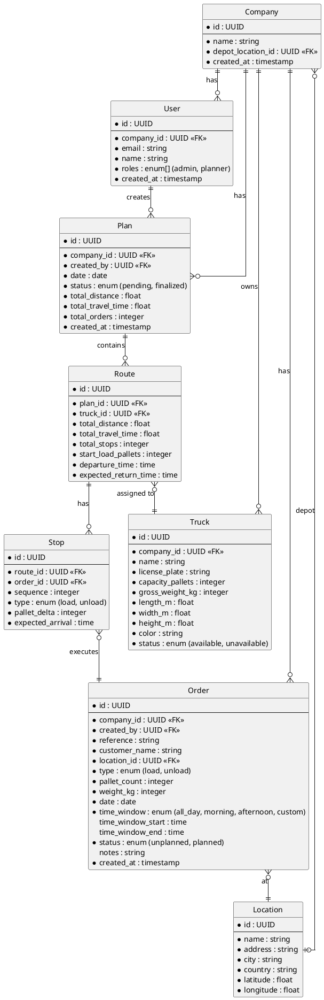
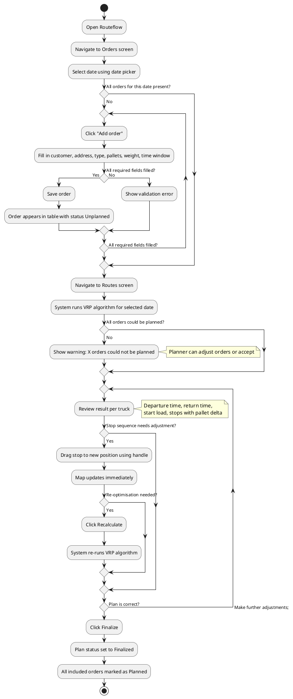
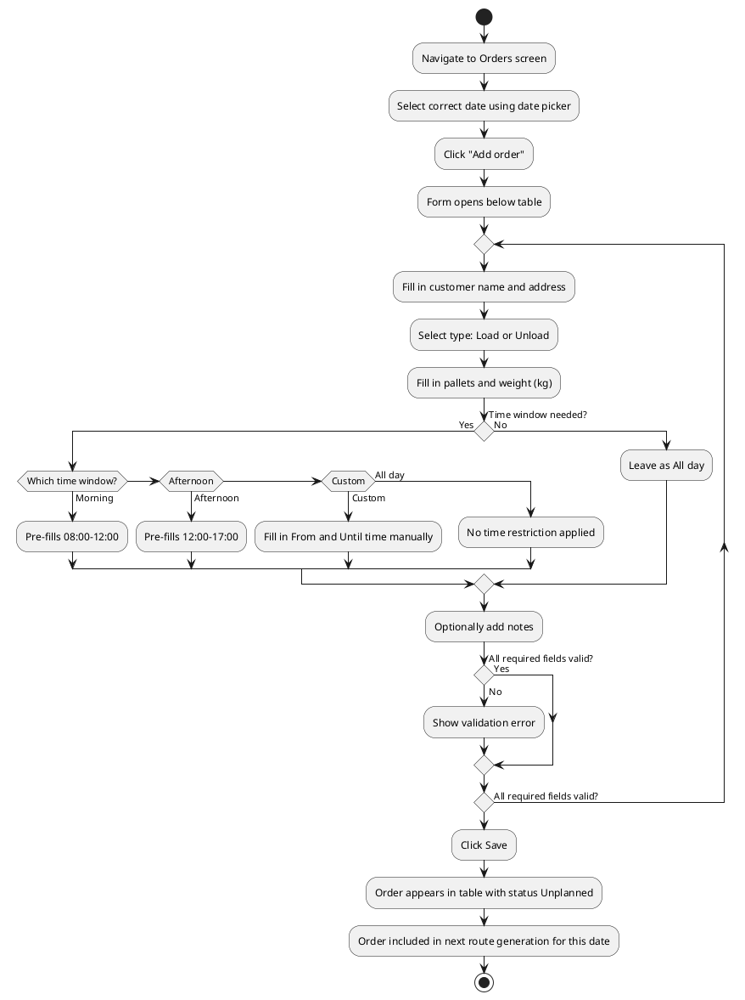
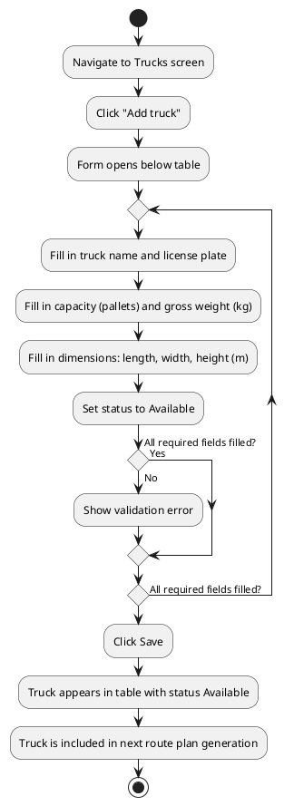
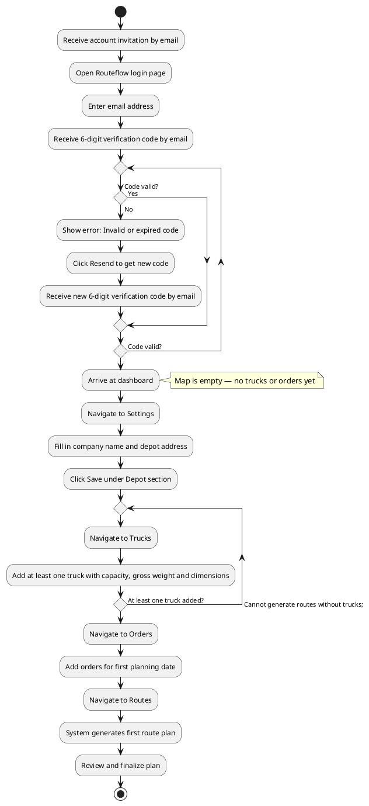

# Functional Design – Routeflow

---

## Introduction

Routeflow is a web application that automates daily route planning for small transport companies. It assigns transport orders to available trucks, determines the optimal stop sequence per truck and visualises the result on an interactive map.

The application targets small transport companies operating fleets of 5 to 15 trucks handling 30 to 60 orders per day. At this scale hiring a dedicated transport planner is often not financially viable. Instead the business owner or a driver with additional responsibilities handles the daily planning. Typically spending one to two hours each day assembling routes manually. Routeflow replaces this manual process with an automated system that generates optimised plans in seconds. Allowing the owner to review and approve rather than build from scratch.

Route calculations are based on real driving distances and durations via OSRM (Open Source Routing Machine). Which uses OpenStreetMap data covering all of Europe.

The underlying problem the Vehicle Routing Problem (VRP) is a well known optimisation challenge in operations research. Its complexity grows exponentially with the number of trucks and orders. Which is precisely why manual planning breaks down as a business grows.

---

## Problem statement

### Current situation

In many small transport companies the daily route plan is assembled manually. The person responsible often the owner receives orders via email, phone or an ERP system and distributes them across available trucks based on experience and intuition. They consider factors like geography, delivery windows, truck capacity and driving time regulations but without the support of optimisation algorithms.

For a typical company with 10 trucks and 50 daily orders this leads to several problems:

**Suboptimal routes** a human planner cannot evaluate all possible combinations. Trucks are often underloaded and drive unnecessary kilometres. A difference of 10-15% in total travel time compared to an optimised plan is realistic.

**Time-intensive process** assembling a daily plan takes an experienced person one to two hours every day. For a business owner this is time that could be spent on customer relationships, exception handling or growing the business.

**Scalability ceiling** what is manageable at 5 trucks and 20 orders becomes an unsolvable puzzle at 15 trucks and 60 orders. Manual planning does not scale linearly it becomes exponentially harder.

**No performance insight** there is no objective way to evaluate whether today's plan is good. The planner does not know how much more efficient the routes could be.

### Desired situation

A web application where the user can:

- Manage trucks and their properties (capacity, gross weight and dimensions).
- Enter transport orders per day (customer, address, number of pallets, weight, type and time window).
- Generate an optimised daily route plan with a single click.
- Review the result visually on a map, including per-route and per-stop statistics.
- Make manual adjustments to the generated plan by reordering stops.
- Finalise the plan once satisfied.

The system accounts for the following constraints:

- Travel time between locations based on real driving distances (via OSRM).
- Truck capacity in pallets.
- Delivery time windows per order.
- Load and unload type per stop (loading adds pallets and unloading removes pallets).
- EU maximum driving time regulations (Regulation (EC) No 561/2006).

---

## Users and roles

Routeflow is organised around companies. A company represents a registered transport business and acts as the top-level entity in the system. All data trucks, orders, route plans and locations belong to a company and is only visible to users within that company. A company is created once during onboarding and managed by the admin. Each company has a name, a depot location and at least one user with the admin role.

A company can have multiple users, each with their own role. Authentication is handled through a passwordless login flow. The user enters their email address and receives a one-time verification code by email.

The system currently supports two roles **admin** and **planner**. A user can hold both roles simultaneously. In smaller companies it is common for the business owner to be the only user, acting as both admin and planner at the same time.

### Admin

The admin is responsible for managing company-level settings such as the company name, depot address and for managing user accounts within the company. Every company has at least one admin. In practice this is typically the business owner.

### Planner

The planner handles the daily route planning. They manage trucks and orders, generate route plans, review and adjust the result and finalise the plan once satisfied. A company can have multiple planners. In smaller operations the admin fulfils this role themselves, while larger companies may have a dedicated planner or senior driver who takes on this responsibility.

### Future extensions

In a later version the system could be extended with a read-only **driver** role. Allowing individual drivers to view their own assigned route for the day. This role is outside the scope of this design.

---

## Domain model

### Entity-Relationship Diagram

The diagram below shows the core entities of the system and their relationships.

### Entity descriptions

#### Company

A company represents a registered transport business. It is the top-level entity in the system all trucks, orders, locations and plans belong to a company. A company has a name and one depot location via `depot_location_id`. The depot location is initially set to the company's address during onboarding.

#### User

A user is a person within a company who has access to Routeflow. Every user belongs to exactly one company. A user can hold one or both of the following roles `admin` and `planner`. The admin role grants access to company settings and user management. The planner role grants access to daily route planning. In small companies the same person typically holds both roles. Authentication is done via email. The email address must be unique across the entire system.

#### Location

A location is a physical address with coordinates (latitude and longitude). Locations are reused across orders and trucks. A customer address only needs to be entered and geocoded once even if that customer receives deliveries on multiple days. One specific location is referenced by the company as its depot via `depot_location_id`. This is where all trucks depart from and return to each day.

#### Truck

A truck is a vehicle owned by the company and available for transport. Each truck has a name, a license plate and physical properties such as pallet capacity, gross weight and dimensions. The capacity in pallets determines how many orders the truck can carry at any point during its route. Each truck also has a display color used to distinguish it on the map. A truck can be set to unavailable to exclude it from route generation without deleting it. The depot a truck departs from and returns to is inherited from the company.

#### Order

An order is a transport assignment for a specific date. It represents what a customer needs such as number of pallets to be delivered or picked up at a specific location. An order has a type `load` means pallets are picked up at this stop (added to the truck) or `unload` means pallets are delivered (removed from the truck). Orders are date-specific and belong to exactly one planning date. An order is created by a planner and starts with the status `unplanned`. Once it is included in a finalised plan it becomes `planned`. If a plan is recalculated the order returns to `unplanned` until the plan is finalised again. The `reference` field holds an external order number such as `ORD-13452`, used to identify the order in external systems or communication with the customer.

#### Plan

A plan represents the complete route plan for a single day within a company. There is at most one plan per company per date. A plan contains multiple routes one for each truck that is deployed that day. The plan tracks totals for travel time, distance and number of orders across all routes. A plan starts with the status `pending` and moves to `finalized` once the planner approves it.

#### Route

A route is the sequence of stops assigned to a single truck within a plan. It inherits its date from the plan it belongs to. A route starts and ends at the company depot. It tracks the total travel time, total distance and number of stops for that truck. The `start_load_pallets` field records how many pallets are on the truck when it departs from the depot. The `departure_time` and `expected_return_time` are calculated based on the route's total travel time and the fixed service time per stop.

#### Stop

A stop is the execution of a single order within a route. It is created by the VRP algorithm when a plan is generated and is deleted and recreated when the plan is recalculated. The `sequence` field determines the order in which the truck visits its stops sequence 1 is the first stop after the depot, sequence 2 is the second and so on. When a planner manually reorders stops via drag-and-drop, the sequence numbers are updated accordingly. The `pallet_delta` records how many pallets are added or removed at this stop that is positive for load or negative for unload. The `expected_arrival` is the calculated arrival time at this stop based on the departure time and travel durations from OSRM.

---

## Wireframes and behavior descriptions

All wireframes have been designed in Balsamiq using a low-fidelity style (greyscale, no branding). The emphasis is on structure, information hierarchy, and interaction behaviour.

[View wireframes](https://balsamiq.cloud/slu85o1/p48stzw)

Below is a description of each screen's content and expected behaviour.

---

### Screen 1 — Login

**URL:** `https://app.routeflow.nl/login`

**Purpose:** Authenticate the planner via a passwordless email code flow.

**Content:**

- Label: "Step 1 of 2"
- Heading: "Routeflow"
- Instructional text: "Enter your email address to receive a login code."
- Field: Email address
- Button: "Send code"
- Link: "No account yet? Contact us"

**Behaviour:**

- On submit the system sends a 6-digit verification code to the entered email address and redirects to the verify screen.
- If the email address is not registered, no error is shown (for security reasons). The user sees the same confirmation regardless.

---

### Screen 2 — Verify code

**URL:** `https://app.routeflow.nl/verify`

**Purpose:** Complete authentication by entering the received verification code.

**Content:**

- Label: "Step 2 of 2"
- Heading: "Routeflow"
- Instructional text: "We sent a 6-digit code to [email address]."
- Field: Verification code
- Button: "Log in"
- Link: "Didn't receive a code? Resend"

**Behaviour:**

- On valid code the user is redirected to the dashboard.
- On invalid or expired code, an error message appears: "Invalid or expired code. Please try again."
- Clicking "Resend" sends a new code and resets the expiry timer.

---

### Screen 3 — Dashboard

**URL:** `https://app.routeflow.nl/dashboard`

**Purpose:** Overview of the current day's route plan with a map view and per-truck summary.

**Content:**

- Left sidebar with navigation: Dashboard (active), Trucks, Routes, Orders, Settings.
- Bottom of sidebar: company name and logout button.
- Main area: full-width interactive map showing all stops for the selected date as coloured pins. Each truck has its own colour; pins are numbered per truck.
- Top-right overlay card showing plan summary for the selected date:
  - Date navigation with left/right arrows (previous/next day)
  - Status (e.g. Pending, Finalized)
  - Total distance (km)
  - Total time
  - Number of orders
- Below the summary card: one card per truck showing:
  - Colour indicator and truck name with license plate
  - Arrow (→) linking to the Routes screen for that date
  - Distance (km)
  - Time
  - Load (pallets)
  - Number of stops

**Behaviour:**

- The date navigation arrows change the selected date and reload the map and truck cards for that date.
- Clicking the arrow (→) on a truck card navigates to the Routes screen with that date pre-selected.
- The sidebar navigation is present on every authenticated screen.
- The company name shown at the bottom of the sidebar comes from Settings.

---

### Screen 4 — Trucks

**URL:** `https://app.routeflow.nl/trucks`

**Purpose:** Manage the fleet — view, add, edit trucks.

**Content:**

- Page title: "Trucks"
- Button top-right: "Add truck"
- Table with columns:
  - Colour indicator (coloured square)
  - Name
  - License plate
  - Capacity (pallets)
  - Gross weight (kg)
  - Status (Available / Unavailable badge)
  - Edit button per row
- Below the table: edit form (visible when "Edit" or "Add truck" is clicked)

**Edit / Add form fields:**

- Name (required)
- License plate (required)
- Capacity in pallets (required, numeric)
- Gross weight in kg (required, numeric — total weight of truck + trailer)
- Dimensions: Length (m) / Width (m) / Height (m) — three fields side by side
- Status (dropdown: Available / Unavailable)
- Buttons: Cancel / Save

**Behaviour:**

- Clicking "Edit" on a row opens the form below the table pre-filled with that truck's data.
- Clicking "Add truck" opens the form empty.
- On save, the truck appears in (or is updated in) the table.
- On cancel, the form closes without changes.

---

### Screen 5 — Orders

**URL:** `https://app.routeflow.nl/orders`

**Purpose:** Manage transport orders per day — view, add, edit orders.

**Content:**

- Header row: title "Orders" on the left, date picker in the centre (with left/right navigation arrows), "Add order" button on the right.
- Table showing all orders for the selected date, with columns:
  - Order ID
  - Customer
  - Address
  - Type (Load / Unload badge)
  - Pallets
  - Weight (kg)
  - Time window (e.g. "08:00–11:00" or "All day")
  - Status (Planned / Unplanned badge)
  - Edit button per row
- Below the table: add/edit form (visible when "Add order" or "Edit" is clicked)

**Add / Edit form fields:**

- Customer name (required)
- Address (required)
- Type toggle: Load | Unload (mutually exclusive, one must be selected)
- Date (required, pre-filled with the currently selected date)
- Pallets (required, numeric)
- Weight in kg (required, numeric)
- Time window selector: All day | Morning | Afternoon | Custom
  - All day: no time restriction, fields hidden, informational text shown
  - Morning: pre-fills 08:00–12:00
  - Afternoon: pre-fills 12:00–17:00
  - Custom: shows From and Until time fields
- Notes (optional, text area)
- Buttons: Cancel / Save

**Behaviour:**

- The date navigation in the header filters the order table to show only orders for the selected date.
- Changing the date does not affect orders already created for other dates.
- The Type toggle is mutually exclusive — selecting Load deselects Unload and vice versa.
- Selecting "All day" hides the time fields and shows the text: "No time restriction — can be delivered any time during the day."
- Selecting Morning, Afternoon, or Custom shows the From/Until time fields with the appropriate default values.
- On save, the order appears in the table for the selected date with status "Unplanned".
- Once a route is generated and finalised for this date, the status changes to "Planned".
- The address field supports autocomplete. When an order is saved, the entered address is automatically geocoded to a location with coordinates for use in route calculation. If the same address was entered before, the existing location is reused.

---

### Screen 6 — Routes

**URL:** `https://app.routeflow.nl/routes`

**Purpose:** View and manually adjust the generated route plan for a selected date.

**Content:**

- Header row: title "Routes" on the left, date picker in the centre (with left/right navigation arrows), "Recalculate" and "Finalize" buttons on the right.
- Left panel (approximately 40% width): scrollable list of truck route cards.
- Right panel (approximately 60% width): interactive map with coloured route pins.

**Left panel — per truck:**

Each truck is shown as a card containing:

- Colour indicator and truck name with license plate
- Route summary: total time, total distance, number of stops
- Departure time and expected return time at depot (e.g. "Departs 07:00 · Back at depot 14:30")
- Start load in pallets (number of pallets on the truck when leaving the depot)
- Ordered list of stops, each showing:
  - Sequence number
  - Customer name
  - Load/Unload badge
  - City and time window
  - Pallet delta: green "+X pallets" for load, red "−X pallets" for unload
  - Drag handle (≡) on the right for manual reordering

**Right panel — map:**

- Coloured numbered pins corresponding to stops in the left panel.
- Each truck's stops share the same colour as the truck's colour indicator.
- Lines connecting stops in sequence to visualise the route.

**Behaviour:**

- On first visiting the Routes screen for a date that has unplanned orders, the system automatically generates a route plan using the VRP algorithm and displays the result.
- Clicking "Recalculate" re-runs the optimisation algorithm, for example after orders have been added or stop sequences have been changed manually.
- The drag handle (≡) on each stop allows the planner to drag stops up or down within the same truck's route to manually adjust the sequence.
- Clicking "Finalize" sets the plan status to "Finalized" and all included orders to "Planned". This action can be undone by recalculating.
- The map updates to reflect any manual reordering.

---

### Screen 7 — Settings

**URL:** `https://app.routeflow.nl/settings`

**Purpose:** Manage company and account information.

**Content:**

- Page title: "Settings"
- Section "Depot":
  - Company name (required, text field, pre-filled)
  - Depot address (required, text field, pre-filled)
  - Save button
- Section "Account":
  - Name (required, text field, pre-filled)
  - Email (required, text field, pre-filled)
  - Save button

**Behaviour:**

- Changes to company name and depot address are saved independently from account changes (separate Save buttons per section).
- The company name shown in the sidebar bottom is sourced from the Depot section.
- Email changes take effect on the next login attempt.
- When the depot address is saved, it is automatically geocoded to a location with coordinates for use in route calculation.

---

## User flows

### Flow 1: Create a daily route plan

---

### Flow 2: Add an order

---

### Flow 3: Add a truck

---

### Flow 4: First time setup

---

## Constraints and business rules

### Capacity rules

- A truck cannot carry more pallets than its `capacity_pallets` at any point in the route.
- The pallet count is tracked dynamically: loading adds pallets, unloading removes pallets.
- The start load at depot reflects the pallets already on the truck before the first stop.
- The algorithm ensures the pallet count never exceeds capacity at any point along the route.

### Driving time rules

- Maximum driving time per day is 9 hours per EU regulation (Regulation (EC) No 561/2006). This value is fixed and not configurable.
- The departure time and expected return time are calculated based on the route's total travel time and service time.

### Time window rules

- If an order has a time window (Morning, Afternoon, or Custom), the truck must arrive within that window.
- "All day" means no time restriction — the stop can be visited at any point during the day.
- Morning corresponds to 08:00–12:00; Afternoon corresponds to 12:00–17:00.
- Orders with tighter time windows receive priority during route assignment.

### Route rules

- Every route starts and ends at the company depot.
- The start load at depot is the total pallet count of all load-type stops in the route (pallets that need to be picked up along the way start at zero; pallets to be delivered are loaded at the depot).

### Data rules

- Email addresses must be unique across the system.
- Locations are stored with coordinates (latitude/longitude) in WGS84 format.
- All times are stored and displayed in the Europe/Amsterdam timezone.
- Orders are date-specific — they belong to exactly one planning date.

---

## Error states

This section describes how the system behaves when something goes wrong or when a screen has no data to display.

### Routes — no orders for selected date

When the planner navigates to the Routes screen for a date that has no orders, the left panel shows an empty state message: "No orders found for this date. Add orders on the Orders page before generating a route." No map pins are shown.

### Routes — orders cannot be planned

When the VRP algorithm cannot assign one or more orders (for example because total pallet demand exceeds the combined capacity of all available trucks), the route plan is still shown for the orders that could be scheduled. A warning message is displayed at the top of the left panel: "X order(s) could not be planned. Reason: total pallet demand exceeds available truck capacity." Unscheduled orders retain the status "Unplanned".

### Routes — no trucks available

When the planner navigates to the Routes screen but no trucks have the status "Available", the screen shows an empty state message: "No trucks available. Set at least one truck to Available on the Trucks page." The Recalculate and Finalize buttons are disabled.

### Orders — empty date

When the selected date has no orders, the order table shows an empty state: "No orders for this date. Click Add order to get started."

### Trucks — empty fleet

When no trucks have been added yet, the trucks table shows an empty state: "No trucks yet. Click Add truck to add your first truck."

### Login — invalid email format

If the user submits an email address that does not match a valid email format, a validation error is shown inline below the field: "Please enter a valid email address."

### Verify code — expired code

Verification codes expire after 10 minutes. If the user submits an expired code, the error message reads: "This code has expired. Click Resend to receive a new code."

### Settings — save failure

If saving Settings fails due to a server error, an error message is shown below the Save button: "Something went wrong. Please try again." The form values are preserved so the user does not lose their input.

---

## User validation

The wireframes and domain model will be validated in two sessions one with a domain expert from the transport industry and one with two fellow students as proxy users. The questions and setup for each session have been prepared in advance and are described below. Results will be added after the sessions have taken place.

The central validation question is: "Is the functional design of Routeflow complete and clear enough to serve as a basis for a technical design and implementation?"

### Validation session 1 — Domain expert

**Who:** Owner of a transport company
**Why:** A transport company owner was chosen because they can validate whether the domain model, constraints and wireframes reflect real daily practice in the transport industry.
**When:** 
**What was shown:** Wireframes in Balsamiq and domain model

**Setup:** The domain expert was asked to walk through the wireframes screen by screen and provide feedback on completeness and realism from a practical transport perspective. Additionally the domain model was discussed to validate whether the entities and their relationships match daily practice.

**Questions asked:**

- Do your trucks always depart from a fixed depot or do they sometimes start from the previous day's last location?
- How are orders currently received via email, ERP or phone?
- Are time windows always set by the customer or also determined internally?
- What information is missing that you would need as a planner?
- Are there constraints I have not accounted for (e.g. ADR/hazardous goods, refrigerated vs. dry transport or weight limits per axle)?

**Feedback:**

...

**Changes made based on feedback:**

...

---

### Validation session 2 — UX validation with fellow students

**Who:** Two fellow software engineering students *(names to be filled in)*
**Why:** Two fellow students were chosen as proxy users to validate whether the interface is intuitive without any domain knowledge. The goal of this session is to verify that a new user can complete the core flow adding orders and generating a route plan without explanation.
**When:** 
**What was shown:** Wireframes in Balsamiq

**Setup:** The students were given the following scenario you are a planner at a transport company with 5 trucks. You have received 20 orders for tomorrow. Walk through the wireframes and create a plan. They were asked to think aloud as they navigated through the screens.

**Points of attention during the session:**

- Where do they hesitate or ask questions?
- Is the load/unload distinction immediately clear?
- Is the date navigation on orders and routes intuitive?
- Do they understand what recalculate and finalize do without explanation?
- Is the drag-and-drop reordering of stops discoverable?
- Do they miss any navigation elements?

**Feedback:**

...

**Changes made based on feedback:**

...

---

## Help received

The following help was received during the creation of this functional design:

...