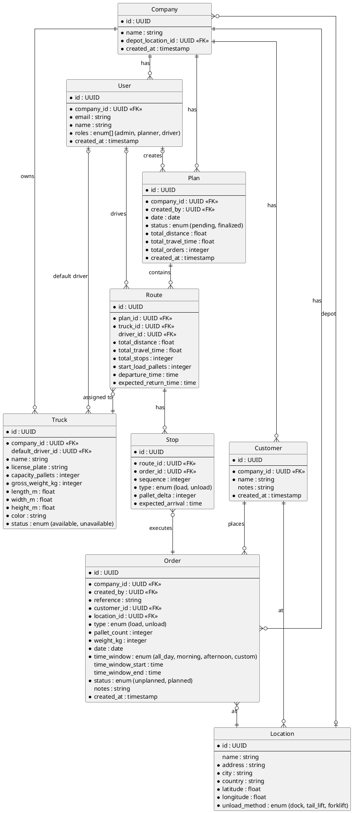
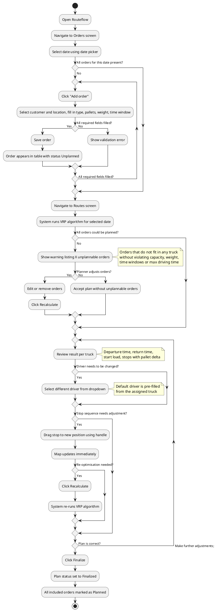
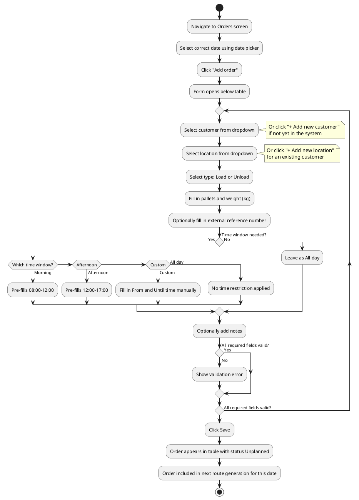
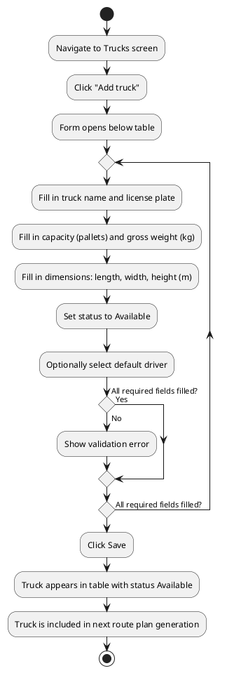
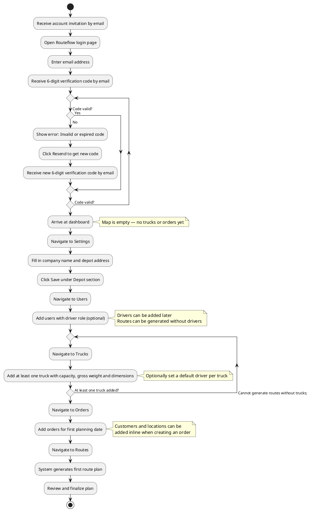

# Functional Design – Routeflow

---

## Introduction

**Routeflow** is a web application that automates daily route planning for small transport companies. It assigns transport orders to available trucks, determines the optimal stop sequence per truck and visualises the result on an interactive map.

The application targets small transport companies operating fleets of 5 to 15 trucks handling 30 to 60 orders per day. At this scale hiring a dedicated transport planner is often not financially viable. Instead the business owner or a driver with additional responsibilities handles the daily planning, typically spending one to two hours each day assembling routes manually. Routeflow replaces this manual process with an automated system that generates optimised plans in seconds, allowing the owner to review and approve rather than build from scratch.

Route calculations are based on real driving distances and durations via OSRM (Open Source Routing Machine) [[1]](#ref-1), which uses OpenStreetMap data and can handle continental-sized networks such as Europe within milliseconds [[2]](#ref-2).

The underlying problem the Vehicle Routing Problem (VRP) is a well known optimisation challenge in operations research. Its complexity grows exponentially with the number of trucks and orders [[3]](#ref-3). Which is precisely why manual planning breaks down as a business grows.

Routeflow is built as a multi-tenant web application. Multiple transport companies can use the same instance simultaneously, with strict data isolation ensuring each company only sees its own trucks, orders and route plans.

---

## Problem statement

### Current situation

In many small transport companies the daily route plan is assembled manually. The person responsible — often the owner — receives orders via email, phone or an ERP system and distributes them across available trucks based on experience and intuition. They consider factors like geography, delivery windows, truck capacity and driving time regulations, but without the support of optimisation algorithms.

For a typical company with 10 trucks and 50 daily orders this leads to several problems:

**Suboptimal routes** a human planner cannot evaluate all possible combinations. Trucks are often underloaded and drive unnecessary kilometres. Research on the Vehicle Routing Problem shows that the difference between manual routing and the true optimal route is on average around 13% [[3]](#ref-3), so a 10-15% gap in total travel time compared to an optimised plan is a realistic estimate.

**Time-intensive process** assembling a daily plan takes an experienced person one to two hours every day. For a business owner this is time that could be spent on customer relationships, exception handling or growing the business.

**Scalability ceiling** what is manageable at 5 trucks and 20 orders becomes an unsolvable puzzle at 15 trucks and 60 orders. Manual planning does not scale linearly it becomes exponentially harder.

**No performance insight** there is no objective way to evaluate whether today's plan is good. The planner does not know how much more efficient the routes could be.

### Desired situation

A web application where the user can:

- Manage trucks and their properties (capacity, gross weight and dimensions).
- Manage customers and their delivery locations centrally, so they can be reused across orders.
- Enter transport orders per day (selecting a customer and location, plus number of pallets, weight, type and time window).
- Generate an optimised daily route plan with a single click.
- Review the result visually on a map, including per-route and per-stop statistics.
- Make manual adjustments to the generated plan by reordering stops.
- Finalise the plan once satisfied.

The system accounts for the following constraints:

- Travel time between locations based on real driving distances (via OSRM).
- Truck capacity in pallets.
- Maximum combined weight of truck plus load, as exceeding the gross vehicle weight can result in fines.
- Delivery time windows per order.
- Load and unload type per stop (loading adds pallets, unloading removes pallets).
- Service time per stop, which varies by unloading method (dock, tail lift or forklift) and scales with the number of pallets.
- EU maximum driving time regulations (Regulation (EC) No 561/2006) [[4]](#ref-4), which limit a driver to 9 hours of driving per day.
- Geographic scope limited to the European Union; orders with locations outside the EU are not supported.

---

## Users and roles

Routeflow is a multi-tenant application, meaning multiple transport companies can use the same instance of the system while their data remains completely isolated from each other. Each company operates in its own tenant and has no visibility into data from other companies.

Routeflow is organised around companies. A company represents a registered transport business and acts as both the top-level entity in the system and the tenant boundary. All data — trucks, orders, route plans and locations — belongs to a company and is only visible to users within that company. A company is created once during onboarding and managed by the admin. Each company has a name, a depot location and at least one user with the admin role.

A company can have multiple users, each with their own role. Authentication is handled through a passwordless login flow. The user enters their email address and receives a one-time verification code by email.

The system supports three roles **admin**, **planner** and **driver**. A user can hold multiple roles simultaneously. In smaller companies it is common for the business owner to be the only user, acting as both admin and planner at the same time, while drivers typically have only the driver role.

### Admin

The admin is responsible for managing company-level settings such as the company name, depot address and for managing user accounts within the company. Every company has at least one admin. In practice this is typically the business owner.

### Planner

The planner handles the daily route planning. They manage trucks and orders, generate route plans, review and adjust the result and finalise the plan once satisfied. A company can have multiple planners. In smaller operations the admin fulfils this role themselves, while larger companies may have a dedicated planner or senior driver who takes on this responsibility.

### Driver

The driver is a read-only role intended for individual truck drivers. A driver has access to a simplified mobile-first view (delivered as a Progressive Web App) where they can see only their own assigned route for the selected day. This includes the stop sequence, customer names, addresses, pallet counts, load/unload type and time windows.

Drivers cannot edit orders, trucks or route plans, and cannot see routes assigned to other drivers. A driver can be set as the default driver for a specific truck, in which case they are automatically assigned to that truck's route whenever a plan is generated. The planner can override this assignment per day, for example when the regular driver is sick or on holiday. This means the same driver can be assigned to truck A on Monday and truck B on Tuesday when needed.

---

## Domain model

### Entity-Relationship Diagram

The diagram below shows the core entities of the system and their relationships.

### Entity descriptions

#### Company

A company represents a registered transport business. It is the top-level entity in the system all trucks, orders, locations and plans belong to a company. A company has a name and one depot location via `depot_location_id`. The depot location is initially set to the company's address during onboarding.

#### User

A user is a person within a company who has access to Routeflow. Every user belongs to exactly one company. A user can hold one or more of the following roles `admin`, `planner` and `driver`. The admin role grants access to company settings and user management. The planner role grants access to daily route planning. The driver role grants read-only access to their own assigned route via the driver PWA. Roles can be combined freely, for example a user who both plans and drives. Authentication is done via email. The email address must be unique across the entire system.

#### Location

A location is a physical address with coordinates (latitude and longitude). Locations belong to a customer (or to the company, in the case of the depot). A customer can have multiple locations — for example a retail chain with different store addresses. A location address only needs to be entered and geocoded once and can be reused across orders. One specific location is referenced by the company as its depot via `depot_location_id`. This is where all trucks depart from and return to each day.

Each location has an `unload_method` indicating how pallets are loaded or unloaded at this address. Possible values are `dock` (loading dock with ramp), `tail_lift` (truck-mounted lift) and `forklift` (external forklift available at the location). This value is used by the planning algorithm to calculate service time per stop, as different unload methods take different amounts of time per pallet. Addresses outside the European Union are not supported.

#### Truck

A truck is a vehicle owned by the company and available for transport. Each truck has a name, a license plate and physical properties such as pallet capacity, gross weight and dimensions. The capacity in pallets determines how many orders the truck can carry at any point during its route. Each truck also has a display color used to distinguish it on the map. A truck can be set to unavailable to exclude it from route generation without deleting it. The depot a truck departs from and returns to is inherited from the company.

Optionally, a truck can have a default_driver_id referencing a user with the driver role. This represents the driver who normally operates this truck. When a route plan is generated, the default_driver_id of each assigned truck is automatically copied to Route.driver_id, so the planner does not need to assign drivers manually in the common case. The planner can override this per route on the Routes screen.

#### Customer

A customer is a business or individual that regularly places transport orders with the company. Storing customers as a separate entity means their details only need to be entered once and can be reused across orders. A customer belongs to exactly one company (tenant) and has a name and optional notes (for example delivery preferences or contact information). A customer can have multiple locations — for example a retail chain with multiple stores — and each order references both the customer and the specific location for that delivery.

#### Order

An order is a transport assignment for a specific date. It represents what a customer needs such as number of pallets to be delivered or picked up at a specific location. An order references a customer_id (who the order is for) and a location_id (where it must be delivered or picked up). Because customers are stored separately, regular customers only need to be entered once and can be reused across orders. An order has a type `load` means pallets are picked up at this stop (added to the truck) or `unload` means pallets are delivered (removed from the truck). Orders are date-specific and belong to exactly one planning date. An order is created by a planner and starts with the status `unplanned`. Once it is included in a finalised plan it becomes `planned`. If a plan is recalculated the order returns to `unplanned` until the plan is finalised again. The `reference` field holds an external order number such as `ORD-13452`, used to identify the order in external systems or communication with the customer.

#### Plan

A plan represents the complete route plan for a single day within a company. There is at most one plan per company per date. A plan contains multiple routes one for each truck that is deployed that day. The plan tracks totals for travel time, distance and number of orders across all routes. A plan starts with the status `pending` and moves to `finalized` once the planner approves it.

#### Route

A route is the sequence of stops assigned to a single truck within a plan. It inherits its date from the plan it belongs to. A route starts and ends at the company depot. It tracks the total travel time, total distance and number of stops for that truck. The `start_load_pallets` field records how many pallets are on the truck when it departs from the depot. The `departure_time` is determined by the planning algorithm to be the latest possible departure from the depot such that all stops on this route can still be served within their time windows. The `expected_return_time` is calculated based on the departure time, the total travel time from OSRM and the service time of each stop. Service time is derived from the `unload_method` of each stop's location and the number of pallets.

The optional driver_id links the route to a user with the driver role. When a route plan is generated, driver_id is automatically initialised with the default_driver_id of the assigned truck. The planner can override this at any time via the driver dropdown on the Routes screen, for example when the regular driver is sick or on holiday. When assigned, the driver can view the route in the driver PWA. A route without a driver is still valid for planning purposes but has no one assigned to view it in the PWA.

#### Stop

A stop is the execution of a single order within a route. It is created by the VRP algorithm when a plan is generated and is deleted and recreated when the plan is recalculated. The sequence field determines the order in which the truck visits its stops sequence 1 is the first stop after the depot, sequence 2 is the second and so on. When a planner manually reorders stops via drag-and-drop, the sequence numbers are updated accordingly. The pallet_delta records how many pallets are added or removed at this stop that is positive for load or negative for unload. The expected_arrival is the calculated arrival time at this stop based on the departure time and travel durations from OSRM.
Note: type and pallet_delta are derived from the linked order at the time of plan generation but stored on the stop itself. This preserves a snapshot of the plan at the moment it was generated and allows the system to detect when an order has been edited after the plan was created.

---

## Planning logic

This section describes how the route generation algorithm behaves from a functional perspective. The algorithmic details (which heuristic, implementation choices) are covered in the technical design; this section defines what the algorithm must achieve and how it handles common situations.

### Hard constraints

The following constraints must be satisfied by any generated plan. A route that violates a hard constraint is never produced.

- **Truck capacity in pallets.** At no point during the route may the number of pallets on the truck exceed `capacity_pallets`.
- **Truck maximum weight.** At no point during the route may the total weight on the truck exceed `gross_weight_kg`. Weight is tracked per stop based on the `weight_kg` of each order.
- **Time windows.** Every stop must be visited within the time window of its order (`all_day`, `morning`, `afternoon` or `custom`).
- **Maximum driving time per route.** In line with EU Regulation (EC) No 561/2006, a single route may not contain more than 9 hours of driving time between depot departure and depot return.
- **Depot start and end.** Every route starts and ends at the company depot.

### Soft constraints (optimisation objective)

Subject to the hard constraints, the algorithm minimises total travel time across all routes in the plan. Total distance is tracked for reporting purposes but is not directly optimised.

### Service time per stop

Each stop has a service time representing the duration the truck is at the location. Service time is calculated as:

service_time = base_time(unload_method) + per_pallet_time(unload_method) × pallet_count

The unload method is a property of the location and can be `dock`, `tail_lift` or `forklift`. The following base and per-pallet values are used:

| Unload method | Base time | Per pallet |
|---------------|-----------|------------|
| Dock          | 15 min    | 1 min      |
| Tail lift     | 15 min    | 3 min      |
| Forklift      | 15 min    | 2 min      |

For example, unloading 10 pallets at a location with a tail lift takes 15 + (3 × 10) = 45 minutes. The calculated service time is added to the route's total travel time and used when checking time window compliance.

### Departure time

The departure time of each route is not fixed but calculated by the algorithm. For each truck, the algorithm determines the latest possible departure time from the depot such that all stops on the route can still be served within their time windows. This means a truck with only afternoon deliveries departs later than a truck with early morning stops, which reduces unnecessary waiting time at locations.

### Unplannable orders

If an order cannot be assigned to any truck without violating a hard constraint, the algorithm first tries to assign it to another truck. If no truck can accommodate it, the order remains unplanned and is reported back to the planner. The planner is shown a warning listing the unplannable orders and can either adjust them (for example by splitting, removing or changing their time window) or accept the plan without them.

### Concurrent planning prevention

Only one plan per company per date can exist at any time. If a planner opens the Routes screen for a date while another planner is already generating a plan for that same date, the second planner sees a warning: "A plan is currently being generated for this date. Please wait and refresh." This prevents two planners from overwriting each other's work.

### External service behaviour

- **OSRM** (Open Source Routing Machine) is self-hosted on the same infrastructure as the application and is treated as always available. If OSRM is temporarily unreachable due to infrastructure issues, the system shows a generic error: "Route generation is temporarily unavailable. Please try again shortly."
- **Geocoding** of new addresses uses an external geocoding API. If geocoding is slow or temporarily unavailable, the user sees a loading state and the save action is retried. Addresses that cannot be geocoded after retries are rejected with an error: "This address could not be found. Please verify and try again."
- **Geographic scope.** Addresses outside the European Union are rejected at geocoding time with the error: "Routeflow currently only supports addresses within the European Union."

---

## Wireframes and behavior descriptions

All wireframes have been designed in Balsamiq using a low-fidelity style (greyscale, no branding). The emphasis is on structure, information hierarchy, and interaction behaviour. Each application has its own Balsamiq project:

- [View planner web app wireframes](https://balsamiq.cloud/slu85o1/p48stzw)
- [View driver PWA wireframes](https://balsamiq.cloud/slu85o1/pmkibw6)

Below is a description of each screen's content and expected behaviour, grouped per application.

---

### Planner web application

The planner web application is designed for desktop use by admins and planners. It has a sidebar layout for navigation and consists of nine screens covering authentication, dashboard overview, fleet management, order and customer management, route planning, user management and company settings.

---

#### Screen 1 — Login

**URL:** `https://app.routeflow.nl/login`

**Purpose:** Authenticate the planner via a passwordless email code flow.

**Content:**

- Label: "Step 1 of 2"
- Heading: "Routeflow"
- Instructional text: "Enter your email address to receive a login code."
- Field: Email address
- Button: "Send code"
- Link: "No account yet? Contact us"

**Behaviour:**

- On submit the system sends a 6-digit verification code to the entered email address and redirects to the verify screen.
- If the email address is not registered, no error is shown (for security reasons). The user sees the same confirmation regardless.

---

#### Screen 2 — Verify code

**URL:** `https://app.routeflow.nl/verify`

**Purpose:** Complete authentication by entering the received verification code.

**Content:**

- Label: "Step 2 of 2"
- Heading: "Routeflow"
- Instructional text: "We sent a 6-digit code to [email address]."
- Field: Verification code
- Button: "Log in"
- Link: "Didn't receive a code? Resend"

**Behaviour:**

- On valid code the user is redirected to the dashboard.
- On invalid or expired code, an error message appears: "Invalid or expired code. Please try again."
- Clicking "Resend" sends a new code and resets the expiry timer.

---

#### Screen 3 — Dashboard

**URL:** `https://app.routeflow.nl/dashboard`

**Purpose:** Overview of the current day's route plan with a map view and per-truck summary.

**Content:**

- Left sidebar with navigation: Dashboard (active), Trucks, Orders, Customers, Routes, Users, Settings.
- Bottom of sidebar: company name and logout button.
- Main area: full-width interactive map showing all stops for the selected date as coloured pins. Each truck has its own colour; pins are numbered per truck.
- Top-right overlay card showing plan summary for the selected date:
  - Date navigation with left/right arrows (previous/next day)
  - Status (e.g. Pending, Finalized)
  - Total distance (km)
  - Total time
  - Number of orders
- Below the summary card: one card per truck showing:
  - Colour indicator and truck name with license plate
  - Arrow (→) linking to the Routes screen for that date
  - Distance (km)
  - Time
  - Load (pallets)
  - Number of stops

**Behaviour:**

- The date navigation arrows change the selected date and reload the map and truck cards for that date.
- Clicking the arrow (→) on a truck card navigates to the Routes screen with that date pre-selected.
- The sidebar navigation is present on every authenticated screen.
- The company name shown at the bottom of the sidebar comes from Settings.

---

#### Screen 4 — Trucks

**URL:** `https://app.routeflow.nl/trucks`

**Purpose:** Manage the fleet — view, add, edit trucks.

**Content:**

- Page title: "Trucks"
- Button top-right: "Add truck"
- Table with columns:
  - Colour indicator (coloured square)
  - Name
  - License plate
  - Default driver (driver name, or "—" if unassigned)
  - Capacity (pallets)
  - Gross weight (kg)
  - Status (Available / Unavailable badge)
  - Edit button per row
- Below the table: edit form (visible when "Edit" or "Add truck" is clicked)

**Edit / Add form fields:**

- Name (required)
- License plate (required)
- Capacity in pallets (required, numeric)
- Gross weight in kg (required, numeric — total weight of truck + trailer)
- Dimensions: Length (m) / Width (m) / Height (m) — three fields side by side
- Default driver (optional, dropdown showing all users with the driver role, plus an "Unassigned" option)
- Colour (required, colour picker — used to distinguish this truck on the map; auto-assigned on creation but can be changed)
- Status (dropdown: Available / Unavailable)
- Buttons: Cancel / Save

**Behaviour:**

- Clicking "Edit" on a row opens the form below the table pre-filled with that truck's data.
- Clicking "Add truck" opens the form empty, with a default colour pre-selected from a palette of distinct colours. The planner can change it before saving.
- On save, the truck appears in (or is updated in) the table.
- On cancel, the form closes without changes.
- The default driver, if set, is automatically assigned to this truck's route whenever a plan is generated. The planner can override this per day on the Routes screen.

---

#### Screen 5 — Orders

**URL:** `https://app.routeflow.nl/orders`

**Purpose:** Manage transport orders per day — view, add, edit orders.

**Content:**

- Header row: title "Orders" on the left, date picker in the centre (with left/right navigation arrows), "Add order" button on the right.
- Table showing all orders for the selected date, with columns:
  - Order ID
  - Customer
  - Address
  - Type (Load / Unload badge)
  - Pallets
  - Weight (kg)
  - Time window (e.g. "08:00–11:00" or "All day")
  - Status (Planned / Unplanned badge)
  - Edit button per row
- Below the table: add/edit form (visible when "Add order" or "Edit" is clicked)

**Add / Edit form fields:**

- Reference (optional, text field — external order number such as "ORD-13452")
- Customer (required, dropdown showing all customers for this company, with a "+ Add new customer" option at the bottom that expands an inline mini-form with fields: Name (required), Notes (optional). On save the new customer is added to the dropdown and selected.)
- Location (required, dropdown showing all locations of the selected customer, with a "+ Add new location" option that expands an inline mini-form with fields: Address (required), City (required), Country (required), Unload method (required, dropdown: Dock / Tail lift / Forklift). On save the new location is geocoded, added to the dropdown and selected.)
- Type toggle: Load | Unload (mutually exclusive, one must be selected)
- Date (required, pre-filled with the currently selected date)
- Pallets (required, numeric)
- Weight in kg (required, numeric)
- Time window selector: All day | Morning | Afternoon | Custom
  - All day: no time restriction, fields hidden, informational text shown
  - Morning: pre-fills 08:00–12:00
  - Afternoon: pre-fills 12:00–17:00
  - Custom: shows From and Until time fields
- Notes (optional, text area)
- Buttons: Cancel / Save

**Behaviour:**

- The date navigation in the header filters the order table to show only orders for the selected date.
- Changing the date does not affect orders already created for other dates.
- The Type toggle is mutually exclusive — selecting Load deselects Unload and vice versa.
- Selecting "All day" hides the time fields and shows the text: "No time restriction — can be delivered any time during the day."
- Selecting Morning, Afternoon, or Custom shows the From/Until time fields with the appropriate default values.
- On save, the order appears in the table for the selected date with status "Unplanned".
- Once a route is generated and finalised for this date, the status changes to "Planned".
- The Customer dropdown lists all customers of the company. Selecting a customer populates the Location dropdown with that customer's known locations. If the customer or location is new, the user can add it directly from the order form via the "+ Add new" options without leaving the page. New locations are automatically geocoded to coordinates for use in route calculation.

---

#### Screen 6 — Routes

**URL:** `https://app.routeflow.nl/routes`

**Purpose:** View and manually adjust the generated route plan for a selected date.

**Content:**

- Header row: title "Routes" on the left, date picker in the centre (with left/right navigation arrows), "Recalculate" and "Finalize" buttons on the right.
- Left panel (approximately 40% width): scrollable list of truck route cards.
- Right panel (approximately 60% width): interactive map with coloured route pins.

**Left panel — per truck:**

Each truck is shown as a card containing:

- Colour indicator and truck name with license plate
- Driver selector (dropdown showing all users with the driver role, plus an "Unassigned" option; pre-filled with the truck's default driver if set)
- Route summary: total time, total distance, number of stops
- Departure time and expected return time at depot (e.g. "Departs 07:00 · Back at depot 14:30")
- Start load in pallets (number of pallets on the truck when leaving the depot)
- Ordered list of stops, each showing:
  - Sequence number
  - Customer name
  - Load/Unload badge
  - City and time window
  - Pallet delta: green "+X pallets" for load, red "−X pallets" for unload
  - Drag handle (≡) on the right for manual reordering
- If another planner in the same company is already generating a plan for the selected date, the screen shows a warning: "A plan is currently being generated for this date. Please wait and refresh."

**Right panel — map:**

- Coloured numbered pins corresponding to stops in the left panel.
- Each truck's stops share the same colour as the truck's colour indicator.
- Lines connecting stops in sequence to visualise the route.

**Behaviour:**

- On first visiting the Routes screen for a date that has unplanned orders, the system automatically generates a route plan using the VRP algorithm and displays the result.
- Clicking "Recalculate" re-runs the optimisation algorithm, for example after orders have been added or stop sequences have been changed manually.
- The drag handle (≡) on each stop allows the planner to drag stops up or down within the same truck's route to manually adjust the sequence.
- Clicking "Finalize" sets the plan status to "Finalized" and all included orders to "Planned". This action can be undone by recalculating. If one or more routes have no driver assigned, a confirmation dialog appears: "X route(s) have no driver assigned. These routes will not be visible in the driver PWA until a driver is assigned. Finalize anyway?" with options [Cancel] and [Finalize anyway].
- The map updates to reflect any manual reordering.
- When a route plan is generated, the driver dropdown is pre-filled with the default_driver_id of the assigned truck. The planner can override this at any time by selecting a different driver or "Unassigned". The assigned driver will see this route in the driver PWA. Changing the driver can be done at any time, including after finalisation.

---

#### Screen 7 — Customers

**URL:** `https://app.routeflow.nl/customers`

**Purpose:** Manage customers and their locations — view, add, edit, and remove customers that regularly place transport orders.

**Content:**

- Page title: "Customers"
- Button top-right: "Add customer"
- Table with columns:
  - Name
  - Number of locations (e.g. "3 locations")
  - Number of orders (total orders placed by this customer)
  - Edit button per row
- Below the table: edit form (visible when "Edit" or "Add customer" is clicked)

**Edit / Add form fields:**

- Name (required)
- Notes (optional, text area)
- Locations section: list of locations belonging to this customer, each with address and city. Button: "Add location"
  - Per location: Address (required), City (required), Country (required), Unload method (required, dropdown: Dock / Tail lift / Forklift), Delete button
- Buttons: Cancel / Save / Delete (Delete only visible when editing)

**Behaviour:**

- Clicking "Edit" on a row opens the form below the table pre-filled with that customer's data and locations.
- Clicking "Add customer" opens the form empty.
- Clicking "Add location" within the form adds a new empty location row that the user can fill in.
- On save, the customer and its locations are stored. Location addresses are automatically geocoded to coordinates for use in route calculation.
- On cancel, the form closes without changes.
- Deleting a customer that has active or historical orders is blocked with an error: "This customer has X order(s) and cannot be deleted. Remove those orders first or archive the customer."
- Deleting a location that is referenced by any order is blocked with an error: "This location is used in X order(s) and cannot be deleted. Remove those orders first."

---

#### Screen 8 — Users

**URL:** `https://app.routeflow.nl/users`

**Purpose:** Manage user accounts within the company — view, add, edit, and remove users. Only accessible to users with the admin role.

**Content:**

- Page title: "Users"
- Button top-right: "Add user"
- Table with columns:
  - Name
  - Email
  - Roles (badges showing Admin / Planner / Driver)
  - Edit button per row
- Below the table: edit form (visible when "Edit" or "Add user" is clicked)

**Edit / Add form fields:**

- Name (required)
- Email (required, must be unique across the system)
- Roles (checkboxes, at least one required):
  - Admin
  - Planner
  - Driver
- Buttons: Cancel / Save / Delete (Delete only visible when editing)

**Behaviour:**

- Clicking "Edit" on a row opens the form below the table pre-filled with that user's data.
- Clicking "Add user" opens the form empty.
- On save, the user appears in (or is updated in) the table. If a new user is added, they receive an invitation email with instructions to log in.
- On cancel, the form closes without changes.
- The Users navigation item in the sidebar is only visible to users with the admin role.
- An admin cannot remove their own admin role if they are the only admin in the company — the system shows an error: "You cannot remove the last admin from the company."
- Deleting a user that is currently assigned as a default driver on a truck is blocked with an error: "This user is assigned as default driver to one or more trucks. Remove those assignments first."

---

#### Screen 9 — Settings

**URL:** `https://app.routeflow.nl/settings`

**Purpose:** Manage company and account information.

**Content:**

- Page title: "Settings"
- Section "Depot":
  - Company name (required, text field, pre-filled)
  - Depot address (required, text field, pre-filled)
  - Depot unload method (required, dropdown: Dock / Tail lift / Forklift, pre-filled)
  - Save button
- Section "Account":
  - Name (required, text field, pre-filled)
  - Email (required, text field, pre-filled)
  - Save button

**Behaviour:**

- Changes to company name and depot address are saved independently from account changes (separate Save buttons per section).
- The company name shown in the sidebar bottom is sourced from the Depot section.
- Email changes take effect on the next login attempt.
- When the depot address is saved, it is automatically geocoded to a location with coordinates for use in route calculation.

---

### Driver PWA

The driver PWA is a separate mobile-first interface accessed via `/drive`. It is designed for use on smartphones and can be installed as a Progressive Web App on the home screen. Drivers log in with the same passwordless email flow as planners, but the layout and navigation are optimised for touch interaction and small screens. The PWA consists of three screens: login, verify code, and the daily route view.

---

#### Screen 10 — Driver login (PWA)

**URL:** `https://app.routeflow.nl/drive/login`

**Purpose:** Authenticate the driver via a passwordless email code flow. This is the mobile-optimised equivalent of the planner login screen, designed for use on phones and delivered as part of the driver PWA.

**Content:**

- Label: "Step 1 of 2"
- Heading: "Routeflow"
- Instructional text: "Enter your email address to receive a login code."
- Field: Email address
- Button: "Send code"
- Link: "No account yet? Contact us"

**Behaviour:**

- On submit the system sends a 6-digit verification code to the entered email address and redirects to the verify screen.
- If the email address is not registered, no error is shown (for security reasons). The user sees the same confirmation regardless.
- The layout is fully responsive and optimised for phone screens — full-width fields and buttons, centred content, large tap targets.

---

#### Screen 11 — Driver verify code (PWA)

**URL:** `https://app.routeflow.nl/drive/verify`

**Purpose:** Complete driver authentication by entering the received verification code.

**Content:**

- Label: "Step 2 of 2"
- Heading: "Routeflow"
- Instructional text: "We sent a 6-digit code to [email address]."
- Field: Verification code
- Button: "Log in"
- Link: "Didn't receive a code? Resend"

**Behaviour:**

- On valid code the driver is redirected to the driver route view.
- On invalid or expired code, an error message appears: "Invalid or expired code. Please try again."
- Clicking "Resend" sends a new code and resets the expiry timer.
- The layout is fully responsive and optimised for phone screens.

---

#### Screen 12 — Driver route view (PWA)

**URL:** `https://app.routeflow.nl/drive`

**Purpose:** Mobile-first view for drivers to see their assigned route for the day. Delivered as a Progressive Web App (PWA) so drivers can install it on their phone home screen.

**Content:**

- Top bar: Routeflow logo and driver name
- Date navigation (defaults to today, with arrows to switch day)
- Route summary card: assigned truck name and license plate, total travel time, total distance, total number of stops, departure time and expected return time at depot
- Ordered stop list (scrollable), each stop showing:
  - Sequence number
  - Customer name
  - Full address (street and city)
  - Load / Unload badge
  - Pallet delta (+X or −X pallets)
  - Time window
  - Notes (if present)
  - "Open in Maps" button that launches the driver's default navigation app (Google Maps, Apple Maps, Waze) with the address pre-filled

**Behaviour:**

- The driver sees only the route assigned to them for the selected date. They cannot see routes of other drivers, orders from other companies, or any edit controls.
- The date navigation arrows allow the driver to view routes for other days, for example to prepare for tomorrow.
- If no route is assigned to the driver for the selected date, the screen shows: "No route assigned for this date. Check with your planner."
- The page automatically reflects updates when the planner recalculates or finalises the plan.
- The view is fully responsive and optimised for phone screens.

---

## User flows

### Flow 1: Create a daily route plan

---

### Flow 2: Add an order

---

### Flow 3: Add a truck

---

### Flow 4: First time setup

---

## User validation

The wireframes and domain model will be validated in two sessions one with a domain expert from the transport industry and one with two fellow students as proxy users. The questions and setup for each session have been prepared in advance and are described below. Results will be added after the sessions have taken place.

The central validation question is: "Is the functional design of Routeflow complete and clear enough to serve as a basis for a technical design and implementation?"

### Validation session 1 — Domain expert

**Who:** Owner of a transport company
**Why:** A transport company owner was chosen because they can validate whether the domain model, constraints and wireframes reflect real daily practice in the transport industry.
**When:** 
**What was shown:** Wireframes in Balsamiq and domain model

**Setup:** The domain expert was asked to walk through the wireframes screen by screen and provide feedback on completeness and realism from a practical transport perspective. Additionally the domain model was discussed to validate whether the entities and their relationships match daily practice.

**Questions asked:**

- Do your trucks always depart from a fixed depot or do they sometimes start from the previous day's last location?
- How are orders currently received via email, ERP or phone?
- Are time windows always set by the customer or also determined internally?
- What information is missing that you would need as a planner?
- Are there constraints I have not accounted for (e.g. ADR/hazardous goods, refrigerated vs. dry transport or weight limits per axle)?

**Feedback:**

...

**Changes made based on feedback:**

...

---

### Validation session 2 — UX validation with fellow students

**Who:** Two fellow software engineering students *(names to be filled in)*
**Why:** Two fellow students were chosen as proxy users to validate whether the interface is intuitive without any domain knowledge. The goal of this session is to verify that a new user can complete the core flow adding orders and generating a route plan without explanation.
**When:** 
**What was shown:** Wireframes in Balsamiq

**Setup:** The students were given the following scenario you are a planner at a transport company with 5 trucks. You have received 20 orders for tomorrow. Walk through the wireframes and create a plan. They were asked to think aloud as they navigated through the screens.

**Points of attention during the session:**

- Where do they hesitate or ask questions?
- Is the load/unload distinction immediately clear?
- Is the date navigation on orders and routes intuitive?
- Do they understand what recalculate and finalize do without explanation?
- Is the drag-and-drop reordering of stops discoverable?
- Do they miss any navigation elements?

**Feedback:**

...

**Changes made based on feedback:**

...

---

## Help received

The following help was received during the creation of this functional design:

...

---

## Sources

[1] Project OSRM. *Open Source Routing Machine*. <https://project-osrm.org/>

[2] OpenStreetMap Wiki. *Open Source Routing Machine*. <https://wiki.openstreetmap.org/wiki/Open_Source_Routing_Machine>

[3] Wikipedia contributors. *Vehicle routing problem*. <https://en.wikipedia.org/wiki/Vehicle_routing_problem>

[4] European Parliament and Council of the European Union. *Regulation (EC) No 561/2006*. EUR-Lex. <https://eur-lex.europa.eu/legal-content/EN/TXT/?uri=CELEX:02006R0561>