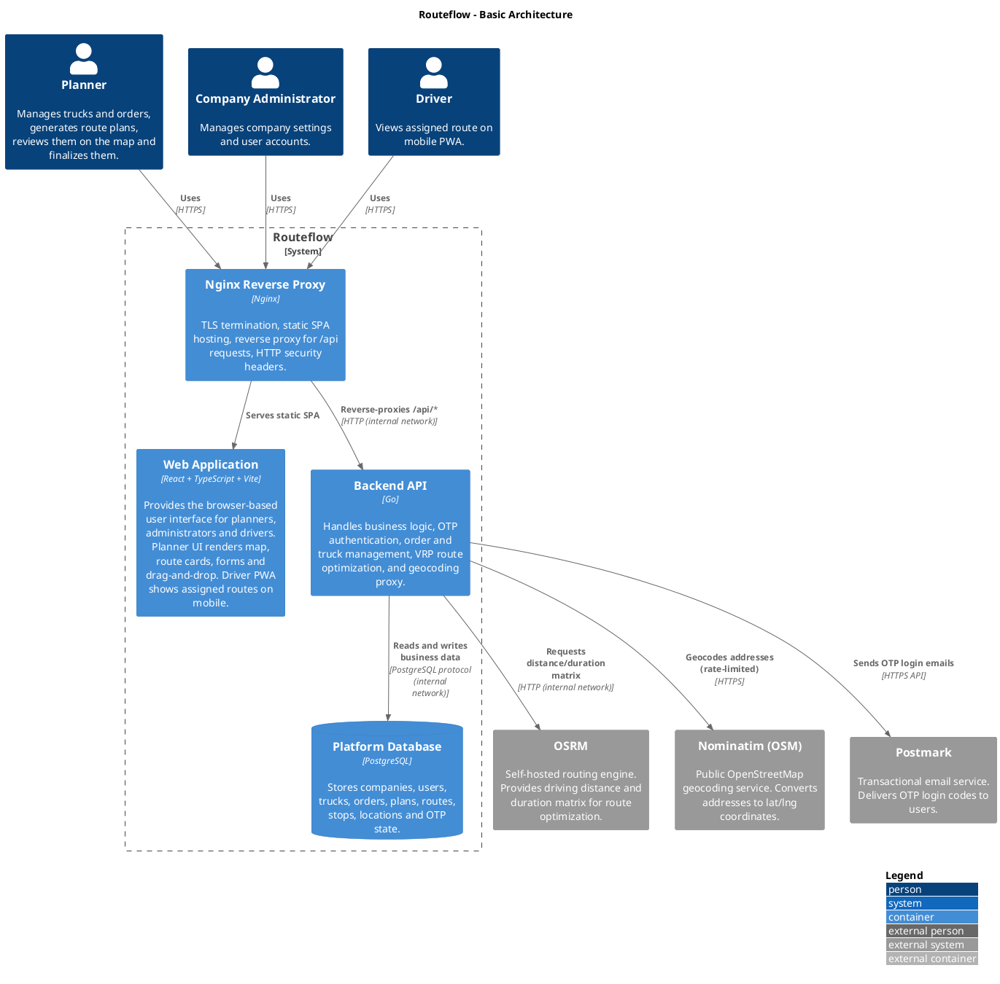
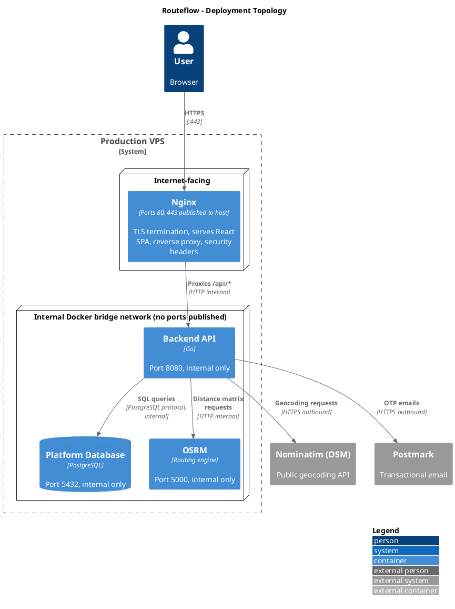
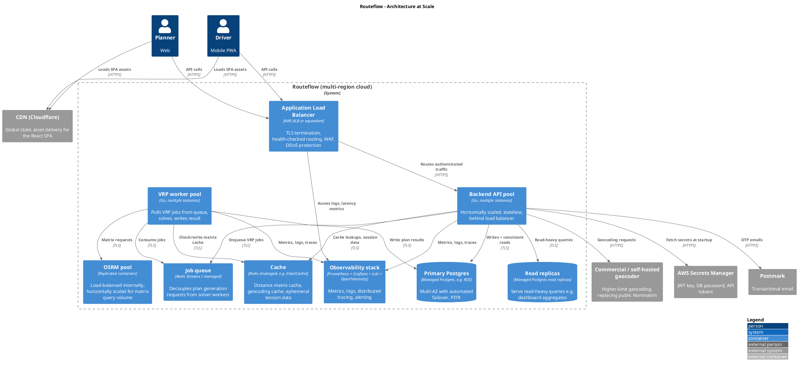

# Technical Design – Routeflow

---

## Introduction

This document describes the technical design for **Routeflow**, a web application that automates daily route planning for small transport companies. It translates the functional requirements into a concrete system architecture and implementation approach.

Routeflow generates optimised route plans by solving a constrained Vehicle Routing Problem (VRP) using real-world driving distances and durations. The system integrates with a self-hosted OSRM routing engine and a geocoding service to convert addresses into coordinates and compute distance matrices.

The backend is responsible for core business logic including order and truck management, route optimisation, and constraint validation (capacity, time windows, and legal driving limits). The frontend provides an interactive interface for planners to review, adjust and finalise generated routes.

This document covers the system architecture, design choices and their motivation, security between components, and how the design would change under extreme scalability and reliability requirements. It assumes familiarity with the Functional Design.

---

## Functional Summary

Routeflow is used by transport companies to plan daily routes. A company has one or more users with roles admin, planner and driver. The admin manages company settings and user accounts. The planner manages trucks and orders, generates route plans, reviews the result on an interactive map, manually adjusts stop sequences via drag-and-drop, and finalises the plan. The driver has a separate mobile-first Progressive Web App that shows only their assigned route for the selected day.

The core constraints enforced by the system:

- Pallet capacity must not be exceeded at any point in a route.
- Combined weight of truck plus load must not exceed the truck's gross vehicle weight.
- Delivery time windows (all day / morning / afternoon / custom) must be respected.
- EU maximum driving time of 9 hours per day (Regulation (EC) No 561/2006).
- Every route starts and ends at the company depot.
- Service time per stop depends on the unload method (dock / tail lift / forklift) and pallet count.

The target scale is 5–15 trucks and 30–60 orders per day per company.

For the full functional specification including wireframes, user flows and the domain model, see the Functional Design.

---

## Technical Overview

The diagram below shows the Routeflow system at container level. Each box is a separately deployable unit or external system.

### Container descriptions

**Nginx Reverse Proxy** is the single public-facing component of the system. It terminates TLS (HTTPS), serves the compiled React SPA as static files, reverse-proxies all `/api/*` requests to the Go Backend API, and adds security headers (HSTS, X-Frame-Options, Content-Security-Policy). This pattern where a single Nginx container serves both the SPA and proxies to the backend is a widely-used production pattern for containerised web applications ([Docker Nginx reverse proxy guide](https://www.docker.com/blog/how-to-use-the-official-nginx-docker-image/)).

**Web Application** is the compiled React SPA bundle. It is not a separate running service at runtime: the production build output of `vite build` is a directory of static HTML/JS/CSS files that Nginx serves directly. During development the app runs via Vite's dev server, but in production there is no Node.js process. This gives a smaller attack surface and lower resource usage than running a Node SSR server.

**Backend API** is the Go server. It exposes a REST API under `/api/*`, handles passwordless OTP authentication, runs the VRP solver, proxies geocoding requests to Nominatim and calls OSRM for driving distances. It is only reachable via Nginx, never directly from the internet.

**Platform Database** stores all domain entities (companies, users, trucks, orders, plans, routes, stops, locations) and OTP authentication state. The schema directly implements the entity model described in the functional design. Only the Backend API has network access to the database.

**OSRM** is a self-hosted routing engine. It provides a `/table` endpoint that returns an N×N matrix of driving durations and distances for a set of coordinates. This matrix is the input to the VRP solver. OSRM is used because the functional design specifies route calculations based on real driving distances.

**Nominatim (OSM)** is the public OpenStreetMap geocoding service. It converts addresses entered by planners into latitude/longitude coordinates required by the Location entity. The Backend API proxies requests to `nominatim.openstreetmap.org` with an identifying User-Agent header and enforces the OSM usage policy of one request per second.

**Postmark** is a SaaS transactional email provider used to deliver OTP login codes to users.

---

## Deployment Architecture

All containers run on a single VPS managed via Docker Compose. The diagram below shows the deployment topology, including which components are reachable from the public internet and which are only reachable on the internal Docker bridge network.

### How requests flow through the system

A concrete example makes the deployment clearer. Consider a planner visiting `https://app.routeflow.nl/routes` and generating a plan for today:

1. **Browser → Nginx (HTTPS).** The browser opens a TLS connection to Nginx on port 443. Nginx presents its Let's Encrypt certificate and decrypts the request.
2. **Nginx serves the SPA.** The path is `/routes`, which does not start with `/api/`, so Nginx serves the static React bundle (the `dist/` output of `vite build` baked into the Nginx image). The browser receives HTML, JavaScript and CSS files.
3. **SPA loads in browser.** React Router sees the `/routes` path and renders the Routes screen. The screen calls `fetch('/api/plans/2026-04-24')` to load the plan.
4. **Browser → Nginx → Backend API.** The request path starts with `/api/`, so Nginx reverse-proxies it to the Backend API on the internal Docker network (hostname `api:8080`). Nginx adds an `X-Forwarded-For` header with the client IP.
5. **Backend API → OSRM / Database.** The API validates the JWT cookie, queries the database for orders and trucks, calls OSRM for a distance matrix, runs the VRP solver, and writes the result back to the database. OSRM and PostgreSQL are reached via internal hostnames (`osrm:5000`, `db:5432`) on the Docker network.
6. **Response back up the chain.** The API returns JSON, Nginx forwards it to the browser, the React app renders the plan on the map.

### Why this deployment topology

**A single entry point simplifies security.** Only port 443 is exposed to the internet. PostgreSQL, OSRM and the Backend API have no published ports on the host — they are only reachable inside the Docker bridge network. An attacker who finds the VPS IP cannot connect to PostgreSQL directly; the only attack surface is Nginx. This "defence in depth" pattern follows [Docker's recommendation for user-defined bridge networks](https://docs.docker.com/engine/network/drivers/bridge/) which provide better isolation than the default bridge network.

**Nginx is battle-tested for this role.** Nginx has been production-grade for TLS termination, reverse proxying and static file serving for over 15 years. It handles HTTP/2, graceful reloads, request buffering and compression out of the box. Alternative tools like Caddy offer simpler config and automatic HTTPS via built-in ACME, but Nginx was chosen because it is more widely known among operators and has better documentation for edge cases.

**Docker Compose is appropriate for single-host deployments.** At the current scale (one VPS, no high availability requirement), Compose provides everything needed: declarative service definition, persistent named volumes for PostgreSQL/OSRM/certs, a private bridge network, and ordered startup with `depends_on`. More complex orchestration (Kubernetes, Swarm) would add operational overhead without benefit. This matches the guidance from [the Docker documentation](https://docs.docker.com/compose/) for multi-container applications on a single host.

**The React build is baked into the Nginx image, not a separate container.** Because the compiled SPA is just static files, there is no reason to run a separate Node.js container for it in production. The multi-stage Dockerfile builds the React app in a `node:20` stage and copies the output into the final `nginx:alpine` image. This keeps the running container count low and avoids the memory overhead of a Node process that would only serve files Nginx can serve faster ([pattern described here](https://blog.kronis.dev/blog/how-to-use-nginx-to-proxy-your-front-end-and-back-end)).

**Persistent volumes for stateful data.** Docker named volumes are used for PostgreSQL data, OSRM pre-processed graph files and Let's Encrypt certificates. These survive container restarts and image updates. Database backups (`pg_dump`) run daily via a cron job on the host and are copied to off-server storage.

### TLS certificates

Nginx uses Let's Encrypt certificates obtained via the `certbot` client, auto-renewed by a scheduled task on the host. The certificates are stored in a named volume mounted into the Nginx container. HSTS is enabled with a one-year max-age, instructing browsers to always use HTTPS for the domain.

---

## Design Choices

This section describes the main technology choices and motivates them against realistic alternatives. Each choice is matched against the requirements of Routeflow specifically — not against general "which language is best" benchmarks, but against the concrete constraints: small team size, a CPU-bound VRP solver, a relational domain model, and a deployment that has to be operable by a single developer.

---

### 1. Go for the backend

**Choice:** The API server is implemented in Go 1.25 using the `chi` router.

**Motivation in depth:**

**Compiled, statically linked binary.** Go compiles to a single executable with no runtime dependencies. This has direct operational consequences: the production Docker image is based on `scratch` or `alpine`, is typically under 20 MB, and starts in milliseconds. Node.js and Python images for comparable functionality are in the hundreds of megabytes once all npm or pip dependencies are installed, and container startup involves interpreter initialisation plus dependency loading. For a small team deploying via Docker Compose on a single VPS, this size difference translates directly into faster CI builds and easier rollbacks.

**Performance under realistic loads.** Multiple independent benchmarks place Go in the same tier as Rust and C# for REST API throughput, and significantly ahead of Node.js and Python. A [2024 benchmark comparing Go, Node.js and Python](https://medium.com/@999daza/comparing-three-favourite-ai-technologies-go-node-js-and-python-76b305e8f372) running identical REST APIs on AWS `m7a.large` instances found Go and Node.js delivered near-identical throughput with Go slightly ahead, while Python lagged significantly. Another [HTTP server benchmark](https://hemaks.org/posts/comparing-web-server-performance-go-vs-nodejs-vs-python/) recorded Go's `net/http` at roughly 6,600 requests per second versus Node.js at roughly 3,950 per second with clustering enabled, and noted that "Python synchronous servers are significantly slower, often more than 4 times slower than Go". This matters for Routeflow because the VRP solver is CPU-bound: while it runs, it blocks one goroutine, and the rest of the API must still respond quickly. Go's scheduler handles this transparently.

**Native concurrency is a good fit for the VRP workload.** Plan generation involves three independent I/O operations: fetching orders from the database, fetching trucks from the database, and requesting the distance matrix from OSRM. In Go these can be run in parallel with three goroutines and a `sync.WaitGroup`, reducing wall-clock latency. Doing the same in Python requires `asyncio` with all the function-colouring complexity that brings, and in Node.js requires careful Promise.all orchestration. The [Talent500 2025 backend comparison](https://talent500.com/blog/backend-2025-nodejs-python-go-java-comparison/) notes that Go's "first-class concurrency through goroutines and channels" is one of the main reasons it has become a favourite for latency-sensitive network services.

**Static typing catches a class of bugs at compile time.** Routeflow has non-trivial domain logic: a route has a sequence of stops, each stop has a type (load/unload), a pallet delta, a service time, and must fit in a time window. With static types the compiler flags it immediately if a handler forgets to convert a `time.Time` to a `time.Duration` or passes a `*Route` where an `*Order` is expected. In Python or JavaScript these become runtime errors hit by users. This is not unique to Go — TypeScript or Java provide the same guarantee — but it ruled out vanilla Python and JavaScript.

**Why `chi` specifically.** `chi` is a lightweight routing library built on Go's standard `net/http` rather than a full framework. It is around 1,000 lines of code, has zero external dependencies, and is used in production at Pressly, Cloudflare and Heroku ([chi documentation](https://github.com/go-chi/chi)). The [chi benchmark](https://github.com/go-chi/chi) shows single-parameter routing at roughly 384 ns per operation with 400 bytes allocated. For context, [Ben Hoyt's router comparison](https://benhoyt.com/writings/go-routing/) concluded that "all of these are plenty good enough — you should almost never choose a router based on performance" and that chi is "one of the fastest" while also being well-designed. The fact that chi is 100% compatible with `net/http` middleware means any open-source middleware (logging, rate limiting, CORS, tracing) works without adapters — critical for a small team that doesn't want to build these from scratch.

**Alternatives considered:**

- **Node.js / TypeScript with Express or Fastify.** Familiar to many developers and fast for I/O-bound workloads. Rejected because the VRP solver is CPU-bound: in Node.js it would block the single event-loop thread unless moved to a worker thread, which adds complexity. Also, TypeScript's type system is erased at runtime, so input validation needs to be duplicated (Zod or similar), whereas Go's compile-time types and runtime types are the same struct.

- **Python with FastAPI.** FastAPI has excellent developer experience and Pydantic for validation. The [Go vs Python FastAPI benchmark by Dmytro Misik](https://medium.com/@dmytro.misik/go-vs-python-web-service-performance-1e5c16dbde76) found Go significantly outperformed FastAPI on an identical algorithm-heavy endpoint, which mirrors the VRP use case. Rejected for the same CPU-bound reasons as Node.js (the GIL limits real parallelism) plus Python's heavier runtime footprint.

- **Java with Spring Boot.** Excellent performance after JVM warmup, mature ecosystem, very strong typing. Rejected because the initial memory footprint and startup time are far higher than Go — a Spring Boot container typically uses 300–500 MB of RAM idle versus Go's 10–20 MB — which matters on a small VPS.

- **Rust with Axum.** Fastest of all options and memory-safe by design. Rejected because the development speed for business logic (CRUD handlers, database access, JSON serialisation) is slower than Go due to the borrow checker, and the ecosystem for things like OpenAPI generation is less mature. The performance gain over Go is not needed at Routeflow's scale.

---

### 2. React with Vite for the frontend

**Choice:** React 18 with TypeScript, built using Vite, with `react-leaflet` for the map, `dnd-kit` for drag-and-drop, and TanStack Query for server state.

**Motivation in depth:**

**Ecosystem maturity for the required libraries.** The two most technically demanding parts of the UI are the interactive map (for stop visualisation) and drag-and-drop reordering of stops within each route. Both have best-in-class React implementations:

- `react-leaflet` is the official React binding for Leaflet, the most widely-used open-source map library. It has native support for custom markers, polylines between stops, and clustering — all needed for Routeflow's dashboard and routes screens.
- `dnd-kit` is a modern, accessible drag-and-drop library with first-class React integration. It handles keyboard accessibility and touch events out of the box, which matters because the functional design requires drag-and-drop on the Routes screen.

The equivalent libraries for Vue (`vue-leaflet`, `vue-draggable-next`) exist but are less mature, have smaller communities and slower release cycles. For Angular, `ngx-leaflet` is maintained but the Angular integration layer adds complexity. This is a real case where React's ecosystem breadth ([noted in the 2025 BrowserStack comparison](https://www.browserstack.com/guide/angular-vs-react-vs-vue): "from state management to routing, developers can choose the best libraries suited to their needs") is a concrete advantage.

**Vite for build tooling.** Vite has become the default modern build tool for React projects, with [LogRocket's 2026 performance guide](https://blog.logrocket.com/angular-vs-react-vs-vue-js-performance/) reporting that "Vite 6 has become the default build tool for Vue and React". Vite's dev server starts in under a second because it uses native ESM and only compiles the files actually requested, whereas the older webpack/Create React App approach bundled the entire app upfront. For production builds, Vite uses Rollup to produce optimised bundles with automatic code splitting per route. In practice this means fast iteration during development and small, cacheable bundles in production.

**TanStack Query for server state.** Server state (data fetched from the API) has different requirements than UI state: it needs caching, invalidation, background refetching, and deduplication of concurrent requests. TanStack Query (formerly React Query) handles all of this declaratively. For example, both the Dashboard and the Routes screens display data for a specific date — TanStack Query ensures they share the cached plan object so switching between them is instant. Mutations (e.g. creating an order) can invalidate the relevant queries so the UI automatically re-fetches and updates. Building this manually with `useState` and `useEffect` quickly becomes error-prone for anything non-trivial.

**No server-side rendering needed.** The app is entirely behind authentication — no search engines need to index it — so SSR brings complexity without benefit. This means the SPA can be deployed as static files served by Nginx, with no Node process running in production.

**Alternatives considered:**

- **Vue 3 with Nuxt / Vite.** Has the lowest barrier to entry of the three big frameworks and [is often considered the fastest framework for onboarding](https://blog.logrocket.com/angular-vs-react-vs-vue-js-performance/). Rejected primarily because `react-leaflet` and `dnd-kit` are more mature than the Vue equivalents, and secondarily because the wider talent pool for React makes future hiring easier.

- **Angular.** Comes with everything built-in (routing, forms, HTTP, DI) and strong TypeScript integration. Rejected because the initial bundle size is larger, the learning curve is steeper, and the opinionated structure adds overhead for a relatively small SPA with seven screens. Angular shines in large enterprise apps with many developers; Routeflow does not fit that profile.

- **Next.js.** A React meta-framework with file-based routing and SSR. Rejected because the app does not need SSR and the extra complexity (Node runtime in production, server components, layered data fetching) is not justified for an authenticated B2B tool.

---

### 3. PostgreSQL for persistence

**Choice:** PostgreSQL 16 as the primary database, accessed via the `pgx` driver in Go.

**Motivation in depth:**

**The domain is inherently relational.** Looking at the functional design's ERD: a Company has many Users and many Trucks; a Plan has many Routes; a Route has many Stops; each Stop references exactly one Order; each Order references exactly one Customer and one Location. Multiple entities have foreign keys that must stay consistent (a Stop can never reference a deleted Order). This is a textbook case for a relational database with enforced foreign keys. PostgreSQL enforces these constraints at the storage layer — the database itself refuses to create an invalid row, regardless of any bug in the application code. The [Dev.to definitive database comparison](https://dev.to/philip_mcclarence_2ef9475/postgresql-vs-mysql-vs-mongodb-the-definitive-database-comparison-1fan) puts this plainly: "You want relational integrity but also need JSONB documents... You care about data correctness and extensibility. Choose PostgreSQL."

**Multi-tenant isolation at the database level.** Every Routeflow domain table has a `company_id` column, and composite foreign keys ensure that, for example, an order's location must belong to the same company as the order. This pattern is enforceable at the database level in PostgreSQL using composite unique constraints and composite foreign keys, which guarantees tenant isolation even if the application layer has a bug. In MongoDB this type of cross-collection integrity would need to be enforced in application code.

**UUIDs as primary keys.** PostgreSQL has a `gen_random_uuid()` function built-in, and UUIDs work naturally with the `pgx` driver's binary protocol. UUIDs prevent ID enumeration attacks (an attacker cannot guess the next URL by incrementing a number) and make it safe to show IDs in URLs or logs without revealing how many companies exist.

**Timezone-aware timestamps.** The functional design specifies that all times are in Europe/Amsterdam and that plans are date-specific. PostgreSQL's `TIMESTAMPTZ` type stores UTC internally and converts on input/output, removing an entire class of timezone bugs. The separate `DATE` and `TIME` types let the schema precisely match the domain (a plan's `date` is a calendar date, not a moment in time).

**`pgx` as the Go driver.** `pgx` is the modern PostgreSQL driver for Go with a high-performance connection pool, native support for binary protocol, and first-class support for PostgreSQL-specific types like UUID, JSONB, and arrays. Its performance and feature set make it the standard choice for Go services that target PostgreSQL specifically.

**Alternatives considered:**

- **MySQL / MariaDB.** Also ACID-compliant with similar foreign key enforcement. Rejected because PostgreSQL has stronger support for the specific features Routeflow uses: partial indexes, `TIMESTAMPTZ` handling, `gen_random_uuid()`, and JSONB if ever needed for audit trails. The [GeeksforGeeks comparison](https://www.geeksforgeeks.org/postgresql/comparing-mysql-postgresql-and-mongodb/) notes that PostgreSQL "supports more features that are difficult in comparison with simple selects like complex queries, ACID compliance and better support of data integrity".

- **SQLite.** Excellent for single-user desktop apps. Rejected because Routeflow is multi-tenant and multi-user — SQLite's single-writer lock would become a bottleneck with concurrent planners, and it does not offer the server-based access control needed for a hosted web app.

- **MongoDB.** Flexible schema, fast for simple document reads. Rejected because the Routeflow domain has heavily interconnected entities — a plan's completeness depends on routes, stops, orders and locations all being consistent. Enforcing this consistency in application code, across a document database, is significantly more error-prone than using the database's native foreign keys. MongoDB only makes sense when the document model fits the domain naturally, which it does not here.

---

### 4. Passwordless authentication (OTP via email)

**Choice:** A 6-digit one-time code sent to the user's email address, expiring after 10 minutes, with bcrypt-hashed storage and a lockout after three failed attempts.

**Motivation in depth:**

**No passwords means no password-related breaches.** The vast majority of real-world authentication compromises involve stolen or reused passwords. Eliminating passwords entirely removes this risk. The functional design specifies passwordless login precisely because the target users (small transport company owners) log in daily and would otherwise either pick weak passwords or forget strong ones. An emailed OTP requires no password manager and no password reset flow.

**bcrypt for OTP storage.** The 6-digit code is never stored in plaintext. The server stores `bcrypt(code)` in the `otp_codes` table. If the database is compromised, the attacker gets hashes that are useless within the 10-minute validity window — bcrypt's intentional slowness makes brute-forcing a 6-digit code against a bcrypt hash take longer than the code is valid. bcrypt also includes per-hash salt automatically, defeating rainbow tables.

**6 digits with lockout is enough entropy.** 6 decimal digits = 1,000,000 possibilities. With a lockout after 3 failed attempts and a 10-minute expiry, the probability of an attacker guessing within the window is 3/1,000,000 = 0.0003%. This is substantially lower than the risk of a password being phished or reused elsewhere.

**User enumeration protection.** The `/api/auth/request-code` endpoint always returns a generic success response, whether the email exists or not. This prevents attackers from discovering valid email addresses by observing different error messages. This matches the functional design's specified behaviour: "If the email address is not registered, no error is shown."

**Rate limiting to mitigate abuse.** The endpoint is limited to 5 OTP requests per email per 15 minutes and 10 OTP requests per IP per 15 minutes. The per-email limit prevents targeted annoyance (filling someone's inbox); the per-IP limit prevents bulk random-email flooding that would otherwise consume Postmark credits.

**Alternatives considered:**

- **Password + email + MFA.** More complex for users (two secrets to manage), more complex to implement (password reset flow, complexity rules, breach detection), and more attack surface. Not worth it for a daily-use B2B tool.

- **Magic link (click-to-login URL).** Equivalent security to OTP. Rejected because clicking the link on a phone opens the default browser rather than the app the user was just in, creating friction. OTP keeps the user in the same browser tab.

- **OAuth (Google / Microsoft).** Would push identity to a trusted third party. Rejected because the target users are small businesses that may not all use Google Workspace or Microsoft 365, and adding OAuth as an external dependency for authentication feels disproportionate.

---

### 5. JWT stored in HttpOnly cookie

**Choice:** After successful OTP verification, the server issues a signed JWT stored in an HttpOnly, Secure, SameSite=Strict cookie with a 7-day expiry.

**Motivation in depth:**

**HttpOnly prevents XSS-based token theft.** A cookie marked `HttpOnly` is inaccessible to JavaScript via `document.cookie`. This means even if an attacker manages to inject a script into the page (through a compromised npm dependency, a CDN compromise, or a subtle XSS bug), they cannot read the authentication token. This is explicitly recommended by [OWASP's Session Management Cheat Sheet](https://cheatsheetseries.owasp.org/cheatsheets/Session_Management_Cheat_Sheet.html): "The HttpOnly cookie attribute instructs web browsers not to allow scripts... an ability to access the cookies via the DOM document.cookie object. This session ID protection is mandatory to prevent session ID stealing through XSS attacks."

**SameSite=Strict strongly mitigates CSRF.** With `SameSite=Strict`, the browser refuses to send the cookie on any cross-site request. An attacker's site cannot trigger an authenticated request to Routeflow just because the user happens to be logged in in another tab. This covers most CSRF attack vectors without needing tokens or headers. The [wisp.blog guide to JWT in HttpOnly cookies](https://www.wisp.blog/blog/ultimate-guide-to-securing-jwt-authentication-with-httponly-cookies) notes that "major tech companies including Google, Microsoft, and Netflix use httpOnly cookies for token storage — and for good reason."

**Secure flag and TLS-only.** The `Secure` flag means the cookie is never sent over plain HTTP. Combined with HSTS, this guarantees that the token only travels over encrypted connections.

**Why not localStorage.** Storing the JWT in `localStorage` is a common pattern but is explicitly discouraged by OWASP: "Do not store session identifiers in local storage as the data is always accessible by JavaScript." Any XSS vulnerability anywhere in the app or in any third-party dependency immediately exposes the token. HttpOnly cookies are the recommended alternative.

**How the JWT is constructed and used.** This is covered in depth in the Security section below, including signing algorithm, claim set, validation flow and revocation strategy.

**Alternatives considered:**

- **Server-side session table with session cookie.** Traditional pattern: a random session ID in a cookie, a sessions table in PostgreSQL, a database lookup per request. More revocation-friendly (delete the row to log someone out) but adds one database read per authenticated request. JWT avoids this read at the cost of not being instantly revocable; the tradeoff is acceptable at Routeflow's scale and privilege level.

- **Short-lived access JWT + refresh token.** Industry best practice for high-security applications: 15-minute access JWT stored in an HttpOnly cookie, 7-day refresh token stored server-side. Gives instant revocation with only one database read per 15 minutes. More complex, deferred to a future version when revocation becomes important enough to justify the added moving parts.

- **JWT in `Authorization: Bearer` header.** Requires the frontend to manage the token in JavaScript and attach it to every request, which means the token must live in memory or `localStorage` — both reachable from XSS. Rejected on security grounds.

---

### 6. VRP solver — greedy insertion + 2-opt, embedded in Go

**Choice:** A custom VRP solver embedded in the Go API server, using greedy nearest-neighbour insertion with time-window checking, followed by 2-opt local search within each route. The solver enforces pallet capacity, weight, delivery time windows, and the EU 9-hour driving time limit as hard constraints.

**Motivation:**

The target problem size (5–15 trucks, 30–60 orders) is small enough that a well-implemented heuristic produces near-optimal plans within a one-second budget. Embedding the solver directly in the Go API avoids the operational complexity of running a separate solver service, and the solver can share in-memory data with the rest of the API without network serialisation.

The detailed algorithm design, alternatives (OR-Tools, LKH, Clarke-Wright), prototype results, and performance measurements are covered in the separate **Problem Solving** document.

**Alternatives considered at the technology level:**

- **Google OR-Tools.** Industry-standard constraint programming solver with excellent VRP support. Requires a Python or C++ process separate from the Go API, adding a second runtime and a network hop per solve. Not justified at this problem scale.

- **External SaaS (e.g. Routific, OptimoRoute).** Paid API, adds a hard external dependency to the critical planning path, and sends customer addresses to a third party. Rejected for cost, data sovereignty and reliability reasons.

---

### 7. OSRM for routing

**Choice:** OSRM (Open Source Routing Machine), self-hosted as a Docker container, used via its `/table` endpoint to obtain driving-time and distance matrices.

**Motivation in depth:**

**OSRM is purpose-built for exactly this use case.** OSRM's `/table` endpoint returns an N×N matrix of driving durations and distances in a single HTTP call. For a 60-order plan this is a 62×62 matrix (depot + 60 stops + depot) computed in milliseconds. This is precisely the input the VRP solver needs. Other open-source routers support single-route queries but not efficient matrix queries. The [GIS-OPS routing engines overview](https://gis-ops.com/open-source-routing-engines-and-algorithms-an-overview/) is explicit about this tradeoff: "If you need highly performant matrix queries on a continental scale, use OSRM."

**Contraction Hierarchies make matrix queries fast.** OSRM pre-processes the OpenStreetMap data into a contraction hierarchy, which dramatically speeds up shortest-path queries at the cost of a one-time preprocessing step. The [Valhalla vs OSRM comparison on StackShare](https://stackshare.io/stackups/osrm-vs-valhalla) explains: "OSRM utilizes Contraction Hierarchies (CH) as its default routing algorithm. CH is an optimization technique that pre-processes the data to enable fast shortest path calculations. It achieves this by contracting less important nodes early, reducing the search space during routing."

**OpenStreetMap data is good enough for small-truck routing in Western Europe.** OSM coverage of the Netherlands and the EU is excellent — every addressable road is in the dataset, along with speed limits, one-way restrictions and turn restrictions. Truck-specific constraints (weight limits on bridges, height limits in tunnels) are not modelled in OSRM's default profile, but for the small trucks (≤3.5 or 7.5 tonnes) typical at Routeflow's target customers, this is not a practical issue. If truck-specific profiles become important, OpenRouteService is a drop-in replacement that supports them.

**Self-hosting means no per-request cost and no rate limits.** The alternative — calling Google's Distance Matrix API — costs roughly $5 per 1,000 elements, so a single 60-stop plan recompute would cost around $20, and planners recompute many times per day. At the target scale this would quickly exceed the revenue per customer. Self-hosted OSRM is free after the one-time setup, and serves matrix queries in milliseconds on commodity hardware.

**Self-hosting setup.** The OSRM Docker image runs in three pipeline steps on the initial data: download the Netherlands OSM extract from Geofabrik, run `osrm-extract` to build a graph, then `osrm-partition` and `osrm-customize` for the MLD (Multi-Level Dijkstra) pipeline. The final `osrm-routed` process serves HTTP queries from the processed graph files. The Netherlands graph fits in under 2 GB of RAM, so the server sizing stays modest. Re-processing is done monthly when OSM data updates.

**Alternatives considered:**

- **Public OSRM demo server.** Zero setup but rate-limited to a few requests per second. Acceptable for development, not for production.

- **OpenRouteService (ORS).** Built on a fork of OSRM with additional features including truck-specific profiles (weight, height, hazmat restrictions). Could replace OSRM in a future version since the domain model already stores truck dimensions. Rejected for now because the default OSRM profile is adequate for small trucks and ORS is more complex to self-host.

- **GraphHopper.** Another open-source routing engine. The [GIS-OPS overview](https://gis-ops.com/open-source-routing-engines-and-algorithms-an-overview/) notes that GraphHopper closed-sourced its matrix API, making the free version less suitable for matrix-heavy workloads. Rejected on that basis.

- **Valhalla.** Very flexible, supports dynamic runtime costing. The same [overview article](https://gis-ops.com/open-source-routing-engines-and-algorithms-an-overview/) notes that "matrix requests take comparatively long" in Valhalla compared to OSRM. For a matrix-heavy VRP workload, OSRM is the better fit.

- **Google Maps Distance Matrix API.** Highest quality data but paid, adds external dependency, and sends customer addresses to Google. Cost alone rules it out.

---

### 8. Nominatim for geocoding

**Choice:** The public Nominatim OpenStreetMap geocoding service, accessed through a server-side proxy in the Backend API with a server-wide rate-limit gate.

**Motivation:**

When a planner enters an order address, the system must resolve it to latitude and longitude for use in the Location entity and the VRP distance matrix. Nominatim uses OpenStreetMap data and is free for reasonable use. Routing through the Backend API rather than calling it directly from the browser avoids CORS issues, centrally enforces the OSM usage policy (one request per second and an identifying User-Agent header), and keeps the frontend decoupled from the geocoding provider so it can be swapped without frontend changes.

**Rate limiting.** The OSM usage policy allows at most one request per second. The Backend API enforces this server-wide via a mutex that guarantees at least 1.2 seconds between outgoing requests.

**Known limitation — latency under concurrent use.** Because the gate is server-wide, concurrent geocoding requests queue up. Entering 10 orders in quick succession introduces roughly 12 seconds of total backend delay. Acceptable at the current scale, but a bottleneck at higher load. At scale this is addressed by caching previously-geocoded addresses in Redis or switching to a self-hosted Nominatim or commercial geocoder (see Scalability).

**Alternatives considered:**

- **Self-hosted Nominatim.** Removes the rate limit and keeps address data internal. Rejected because the operational cost (significant disk, RAM, and initial import) is not justified at the current scale.
- **Photon.** Lighter-weight geocoder based on OpenStreetMap. Less mature.
- **Google Geocoding API.** More accurate, higher rate limits, but paid and sends address data to Google.

---

### 9. Docker Compose on a single VPS

**Choice:** All containers run on one VPS orchestrated by Docker Compose. Nginx handles HTTPS, serves the React build, and reverse-proxies API requests to the Go backend.

**Motivation:**

At the MVP scale (5–15 trucks, 30–60 orders per company, target 50–100 companies on a single server), the operational and financial cost of Kubernetes or managed cloud services is not justified. A single `docker-compose.yml` defines all services, their networks, and their persistent volumes. The deployment process is a git pull followed by `docker compose up -d`. Named volumes persist PostgreSQL data, OSRM processed graphs, and Let's Encrypt certificates across container restarts and image updates.

**Alternatives considered:**

- **Caddy instead of Nginx.** Caddy has simpler config and automatic HTTPS via built-in ACME. Rejected because Nginx has better documentation, wider operator familiarity, and is easier to debug when something goes wrong.
- **Managed cloud (AWS ECS, GCP Cloud Run).** More resilient but significantly more complex and expensive at MVP scale. Considered for the scalability scenario below.
- **Bare-metal systemd services.** Harder to reproduce, roll back, or update atomically. Docker provides clean service separation with almost no overhead.

---

## Security

This section describes how security is handled between the components of the system. The focus is on what each connection does, why it is considered secure, and where the trust boundaries lie. Configuration specifics (cipher suites, exact TLS versions, header values) are deferred to operational documentation.

### Overall threat model

Routeflow handles business-critical data (customer addresses, order details, truck locations) for multiple transport companies sharing one deployment. The main threats are:

1. **Cross-tenant data leakage** — company A seeing company B's data.
2. **Stolen authentication tokens** — an attacker posing as a legitimate user.
3. **Injection attacks** — SQL injection, XSS, CSRF.
4. **Eavesdropping on network traffic** — reading data in transit.
5. **Direct database access** — an attacker bypassing the API to read the database.

Each of the security measures below addresses one or more of these threats.

### Browser ↔ Nginx

**What happens.** The browser opens a TLS 1.2+ connection to Nginx on port 443. Nginx presents a Let's Encrypt certificate issued for `app.routeflow.nl`. All subsequent traffic is encrypted.

**Why it is secure.** TLS provides confidentiality (attackers on the network cannot read the traffic), integrity (attackers cannot modify traffic without detection), and server authentication (the browser verifies the certificate chains up to a trusted CA). The HSTS header (`Strict-Transport-Security: max-age=31536000`) tells the browser to refuse any future plain-HTTP connection to the domain, preventing downgrade attacks. HTTPS-only cookies (the `Secure` flag) ensure authentication tokens are never sent unencrypted. Standard HTTP security headers harden the response further: `X-Frame-Options: DENY` prevents clickjacking, `X-Content-Type-Options: nosniff` blocks MIME sniffing, and a strict `Content-Security-Policy` limits what scripts the page can execute.

**Trust boundary.** This is the only connection that crosses the public internet for regular user traffic. Everything behind Nginx is on a private Docker bridge network.

### Nginx ↔ Backend API

**What happens.** Nginx forwards `/api/*` requests to the Backend API via the internal Docker bridge network, using plain HTTP on a port that is not published to the host. Nginx adds the `X-Forwarded-For` and `X-Forwarded-Proto` headers so the API knows the original client IP and that the original connection was HTTPS.

**Why it is secure without in-transit encryption.** The Docker bridge network is a software-defined network inside the host's Linux kernel. Traffic on it never leaves the host machine and is never visible on any network interface. The Docker documentation explains that by default, "containers connected to different bridge networks can only communicate with each other using published ports" ([Docker bridge network documentation](https://docs.docker.com/engine/network/drivers/bridge/)) — and the Backend API's port is not published at all. The only way to reach it is from another container on the same bridge network. This matches the [Docker networking security guidance](https://dev.to/hexshift/securing-docker-networking-limiting-exposure-and-enhancing-isolation-216p) that "for services that do not need external exposure, you should avoid publishing ports to the host. Binding to 127.0.0.1 or using internal-only networks can help restrict access."

**Authentication on every request.** The Backend API trusts that traffic reached it through Nginx but does not trust Nginx to vouch for the user. Every request to a protected endpoint is authenticated via the JWT cookie (see below) — Nginx is just a pipe. This means a bug in Nginx's configuration cannot escalate to unauthenticated database access.

### Authentication and the JWT

**How the JWT is created.** On successful OTP verification, the Backend API creates a JWT with the following claims: `sub` (the user's UUID), `cid` (the company UUID), `roles` (array of admin/planner/driver), `iat` (issued-at timestamp), and `exp` (expiry, 7 days from issue). The token is signed with HMAC-SHA256 using a 256-bit secret key that is loaded from an environment variable at startup. The resulting token is set as a cookie with the attributes `HttpOnly`, `Secure`, `SameSite=Strict`, `Path=/`, and a `Max-Age` matching the JWT expiry.

**How it is validated.** On every request to a protected endpoint, the JWT middleware extracts the cookie, verifies the HMAC signature against the server's secret key, checks that the token is not expired, and parses the claims. If any step fails, the request is rejected with `401 Unauthenticated`. If it succeeds, the user's UUID, company UUID and roles are injected into the request context so handlers can access them without re-parsing the cookie. Handlers never accept user UUID or company UUID from request bodies — those values always come from the validated claims.

**What it protects against.** The HMAC signature prevents tampering: an attacker cannot modify the claims (e.g. change roles to `["admin"]`) without invalidating the signature. The HttpOnly attribute prevents JavaScript-based token theft (XSS cannot read the cookie). The SameSite=Strict attribute prevents CSRF (a malicious site cannot make the browser send the cookie cross-origin). The Secure attribute prevents the token from being sent over plain HTTP. This combination is the approach recommended by [OWASP's Session Management Cheat Sheet](https://cheatsheetseries.owasp.org/cheatsheets/Session_Management_Cheat_Sheet.html).

**Known limitation: no instant revocation.** Because JWT validation is stateless, there is no way to revoke an individual token before its 7-day expiry. If an account is compromised, the emergency mitigation is to rotate the signing secret, which invalidates every token system-wide and forces all users to log in again. This tradeoff is acceptable at the current scale because the daily-use OTP naturally shortens the window in which a stolen token is useful. At scale this is replaced with a short-lived access JWT plus a server-side refresh token.

**Layered CSRF defence.** Although SameSite=Strict covers most CSRF cases, an additional double-submit cookie pattern is used as defence in depth. On login the server sets a second cookie `csrf_token` (readable by JavaScript, *not* HttpOnly) with a random 32-byte value. The frontend reads this cookie and echoes it in an `X-CSRF-Token` header on every state-changing request. The server rejects mismatched or missing values with `403 Forbidden`. An attacker's site cannot read the `csrf_token` cookie due to the same-origin policy, so cannot forge a matching header.

### Backend API ↔ PostgreSQL

**What happens.** The Backend API connects to PostgreSQL on the internal Docker network using a username/password authentication scheme (`scram-sha-256`). The credentials are loaded from environment variables at API startup and are never logged or sent to the client. All SQL statements use parameterised placeholders via `pgx`, never string interpolation.

**Why it is secure.**

First, the database port is not published to the host, so no external network can reach PostgreSQL. The only access path is from containers on the same Docker bridge network, which in this deployment is only the Backend API container.

Second, every query is scoped to the authenticated user's company. This is enforced at the repository layer: every `SELECT`, `UPDATE`, or `DELETE` against domain tables has a `WHERE company_id = $1` clause with the company UUID taken from the JWT claims. This means even if a handler has a bug and the request body contains a malicious ID, the query returns zero rows instead of another company's data. For example, updating a truck uses `UPDATE trucks SET ... WHERE id = $1 AND company_id = $2` — if the truck belongs to a different company, the affected row count is zero and the handler returns 404.

Third, the composite foreign key from `orders` to `locations` (enforcing that `orders.company_id = locations.company_id`) means even a malicious INSERT with a crafted location UUID fails at the database level if the location belongs to another company. This is defence in depth: the application layer and the database layer both have to be correct for tenant isolation to hold, which means both would have to be wrong for a leak to occur.

Fourth, SQL injection is prevented categorically by the use of parameterised queries. The `pgx` driver sends the query text and the parameters as separate wire-protocol messages — there is no way for parameter content to be interpreted as SQL, regardless of what the content contains.

**Why TLS between API and DB is not added at MVP scale.** TLS between the API and PostgreSQL could be added by configuring `ssl = on` in `postgresql.conf` and `sslmode=require` on the client side, following the [PostgreSQL SSL documentation](https://www.postgresql.org/docs/current/ssl-tcp.html). This is genuinely valuable when the database is on a different host than the API. In this deployment both containers run on the same VPS, on a bridge network inside the same Linux kernel — traffic between them never touches any physical network. Adding TLS here protects against an attacker who has already gained root on the host, at which point the attacker can read the TLS key files and bypass the protection anyway. At scale, when the database moves to a managed service on a separate host, TLS becomes mandatory and is added (see Scalability).

### Backend API ↔ OSRM

**What happens.** The Backend API calls OSRM's HTTP `/table` endpoint on the internal Docker network, sending a list of coordinates and receiving a matrix of durations and distances. No authentication.

**Why it is secure.** The OSRM port is not published to the host; only containers on the same bridge network can reach it. OSRM has no user data and no state beyond the read-only OpenStreetMap graph, so an attacker who somehow reached it could learn nothing sensitive. The input is a list of coordinates (floating-point numbers), validated by the Backend API before the call is made — malformed input is rejected before it reaches OSRM, preventing injection into the URL path.

The same justification as for PostgreSQL applies: at MVP scale both containers are on the same host, TLS would protect against on-host kernel-level attackers (who can bypass it anyway), and the operational cost is not justified. If OSRM moves to a separate host, TLS is added.

### Backend API ↔ Nominatim (OSM)

**What happens.** The Backend API calls `https://nominatim.openstreetmap.org/search` over public HTTPS, proxying geocoding requests from the frontend. The outgoing request includes an identifying `User-Agent` header per the OSM usage policy.

**Why it is secure.** The connection is TLS to a public service, so traffic is encrypted end to end. The request contains an address string (which is not a secret — it will be printed on delivery paperwork) and no authentication token. Nominatim responses are JSON and are parsed strictly by the API; any unexpected content is rejected rather than passed through.

**Server-side proxy, not direct client call.** The frontend could theoretically call Nominatim directly, but proxying has three benefits: it avoids CORS complications, it centralises the rate-limit gate so one misbehaving browser tab cannot exceed the OSM policy, and it lets Routeflow swap geocoding providers without frontend changes.

### Backend API ↔ Postmark

**What happens.** The Backend API calls Postmark's HTTPS API to send OTP emails, authenticating with a server API token loaded from an environment variable.

**Why it is secure.** TLS end to end. The API token is never exposed to the frontend or logged. Postmark has a documented SOC 2 Type II audit and standard email security practices (SPF, DKIM, DMARC) configured for the `routeflow.nl` domain.

### Secrets management

The JWT signing key, the Postmark API token, the database password and OSRM admin credentials are all stored in a `.env` file on the production VPS with file permissions `chmod 600` (readable only by root). Docker Compose loads them at container start. They are never committed to the git repository — the repository contains only a `.env.example` with placeholder values.

At scale, these move to a dedicated secrets manager (AWS Secrets Manager, HashiCorp Vault) so that rotation can be automated and access can be audited.

### Input validation and output encoding

All inputs from users are validated server-side in the Go handlers, using explicit validation rules per field (length, type, range, allowed enum values). Frontend validation (using Zod schemas) exists for UX only and is never trusted on the server.

Output to the browser is React's default escaping: any string rendered in JSX is HTML-escaped, preventing XSS from user-provided content (customer names, notes, addresses). The Backend API additionally strips control characters from text fields before persisting, so malicious content never reaches the database in the first place.

### Logging and privacy

The Backend API uses Go's `slog` package to emit structured JSON logs. PII fields (email addresses, customer names, street addresses, geocoding queries) are redacted to `[redacted]` before being written, so logs shipped to a monitoring service never contain personal data. This complies with the GDPR principle of data minimisation: logs retain what is needed for debugging (request IDs, timings, error types) without retaining identifiers.

Error stack traces are logged in full for debugging but without PII payloads. Log retention is 30 days.

---

## Scalability and Reliability

The design above is intentionally shaped for the MVP scale: roughly 50–100 companies on a single VPS with 4–8 CPU cores and 16 GB of RAM. Within that envelope the only tuning required is vertical — a bigger VPS — and no architectural changes are needed.

This section describes how the design would change if Routeflow had to support thousands of companies, tens of thousands of daily plans, and 99.9% uptime. Each change below is a deliberate step up in both resilience and operational complexity.

### Why the current design is a bottleneck at scale

Four limitations become real under heavy load:

1. **Single point of failure.** One VPS means any hardware, network or disk failure takes the entire system offline. Any deployment that needs a restart causes downtime.
2. **CPU-bound VRP blocks the API.** The VRP solver runs synchronously inside the API process. During the morning peak, when every planner generates their daily plan within the same hour, a pool of solver runs could saturate all available CPU and starve unrelated API requests.
3. **PostgreSQL is coupled to the host.** Database scaling (read replicas, automated failover, point-in-time recovery) is not possible without rebuilding it on managed infrastructure.
4. **OSRM shares resources with everything else.** A burst of matrix requests competes for the same CPU as the API and database.

### Target architecture at scale

The diagram below shows the system redesigned for horizontal scale and high availability. Each change to the MVP design is annotated in the descriptions that follow.

### What changes and why

**1. Horizontally scaled, stateless API pool behind a load balancer.**

The Go API is already stateless (JWT-based auth, no server-side session, no local cache). Multiple instances can be placed behind a cloud load balancer (AWS Application Load Balancer, GCP Load Balancer, or Nginx Plus) without modification, and auto-scaled based on CPU and request latency. This is the textbook pattern for scaling REST APIs — [DreamFactory's scaling guide](https://blog.dreamfactory.com/scaling-rest-apis-for-high-volume-databases-dreamfactory) puts it plainly: "At the core of these strategies lies the stateless design pattern, which supports horizontal scaling." Stateless services are described by [AutoMQ](https://www.automq.com/blog/stateless-vs-stateful-architecture-a-comprehensive-comparison) as "ideal for high-traffic APIs, content delivery networks, and serverless computing platforms, where rapid provisioning and fault tolerance are critical."

The load balancer handles TLS termination and provides WAF (Web Application Firewall) rules and managed DDoS protection. A failing instance is removed from rotation automatically via health checks without affecting user-facing traffic.

**2. Async VRP via a job queue and dedicated worker pool.**

The synchronous call `POST /api/plans/{date}` becomes asynchronous. The API enqueues a job on Redis Streams and immediately returns `202 Accepted` with a job ID. A separate pool of Go worker containers consumes from the queue, runs the VRP solver, and writes the result back to the database. The frontend receives the result via Server-Sent Events on a per-job channel.

This decoupling has two benefits: (1) a burst of morning plan generations no longer starves unrelated API requests because VRP runs on its own workers, (2) workers can be scaled independently based on queue depth. This follows the pattern described in [scalability design patterns for microservices](https://digitalfractal.com/scalability-design-patterns-microservices/): "Horizontal scaling can significantly boost throughput... This pattern is particularly effective for stateless microservices that are CPU- or I/O-intensive and can run in multiple identical instances."

**3. Managed PostgreSQL with read replicas and automated failover.**

PostgreSQL moves from a container on the host to a managed service (AWS RDS, Azure Database for PostgreSQL, or Supabase). This gives:

- Multi-AZ deployment with automated failover (target RTO under 1 minute)
- Point-in-time recovery (target RPO of 15 minutes)
- Read replicas for read-heavy queries (e.g. dashboard aggregates, reporting)
- TLS-encrypted connections mandatory, as recommended by [Azure's PostgreSQL TLS documentation](https://learn.microsoft.com/en-us/azure/postgresql/security/security-tls) and the [PostgreSQL SSL guide](https://www.postgresql.org/docs/current/ssl-tcp.html). The API uses `sslmode=verify-full`, verifying both the certificate chain and the hostname.
- Automated backups, patching and minor-version upgrades

The application code barely changes — only the connection string updates. Read-heavy queries are routed to a replica by using a separate connection pool configured to target the replica endpoint.

**4. Redis for caching and session data.**

Redis becomes a core dependency at scale:

- **Distance matrix cache.** For companies with stable locations (same customers daily), the OSRM distance matrix can be cached in Redis with a TTL. Cache key is based on sorted pairs of location UUIDs; invalidation happens explicitly when a location's coordinates change (`DEL cache:matrix:*:{location_uuid}:*`). A cache hit avoids the OSRM call entirely, cutting plan-generation latency significantly.
- **Geocoding cache.** Previously-geocoded addresses are cached with a long TTL (weeks), since addresses rarely move. This reduces outgoing geocoder requests dramatically.
- **Job queue.** Redis Streams carries the VRP job queue.

Redis is used in managed form (AWS ElastiCache, Redis Cloud, or Upstash) to avoid operating it directly.

**5. Replicated OSRM pool.**

OSRM runs as multiple containers behind an internal load balancer, sized for peak matrix-query volume. For very high volumes a commercial routing API (HERE, TomTom Routing API, OpenRouteService managed) can replace the self-hosted OSRM, trading cost for operational simplicity.

**6. Geocoding replacement.**

The public Nominatim API is not viable at this scale (one request per second, no SLA). Options:

- **Self-host Nominatim** on dedicated infrastructure.
- **Commercial geocoder** (Google, HERE, Mapbox, Radar). Higher quality, an SLA, and much higher rate limits, at per-request cost. With Redis caching the effective cost per unique address stays low because repeated addresses hit the cache.

**7. CDN for static assets.**

The React SPA is served from a CDN (Cloudflare, AWS CloudFront, Fastly) rather than from the Nginx container. This gives global edge caching, automatic DDoS protection, and offloads static-file bandwidth from the origin. The deployment splits: the SPA is served from `cdn.routeflow.nl`, the API from `api.routeflow.nl`. CORS and cookie-domain config are updated accordingly — the authentication cookie's `Domain` is set to `.routeflow.nl` so it is sent to both subdomains, and CORS on the API explicitly allows the CDN origin.

**8. Secrets manager.**

The `.env` file is replaced by a dedicated secrets manager. At startup, API and worker containers fetch their secrets from the manager using an instance-role identity. This enables automated secret rotation (the JWT signing key can be rotated on a schedule without a deploy) and gives an audit trail of which instance read which secret when.

Because all JWT validation is stateless and based on the signing key, rotating the key invalidates every existing token and forces all users to re-authenticate — this is the emergency revocation mechanism described earlier.

**9. Observability stack.**

At scale, basic logging is not sufficient. The observability stack adds:

- **Prometheus + Grafana** for metrics: API response times per endpoint, VRP solver duration distribution, queue depth, cache hit rate, error rates by error code.
- **Loki** (or equivalent) for centralised structured log aggregation across the API and worker pools.
- **OpenTelemetry** for distributed tracing: a single request ID flows from the load balancer through the API, into the queue, out to a worker, through OSRM and back, so that latency spikes can be traced to their source. [The OpenTelemetry + chi guide](https://golang.elitedev.in/golang/complete-guide-to-integrating-chi-router-with-opentelemetry-for-production-grade-go-application-obse-1ea6b9d7/) notes: "OpenTelemetry handles the complexity of data collection. Getting started doesn't require a massive overhaul. You can begin by instrumenting your main router as shown. This single step gives you immediate, high-level visibility."
- **Alerting** (Alertmanager, PagerDuty) on SLO breaches: error rate over 1%, p95 latency over 2 seconds, queue depth growing unboundedly, or any health check failing.

### Recovery objectives

| Objective | MVP (single VPS) | At scale (managed services) |
|-----------|------------------|------------------------------|
| Recovery Point Objective (RPO) | ~24h (daily `pg_dump`) | 15 min (PITR on managed Postgres) |
| Recovery Time Objective (RTO) | ~4h (manual restore on replacement VPS) | <1h (automated failover) |
| Deployment downtime | Minutes during `docker compose up` | Zero (rolling deploy across API pool) |
| Target availability | ~99% (single host, single zone) | 99.9%+ (multi-AZ, multi-instance) |

### Summary of changes

| Concern | MVP (single VPS) | At scale |
|---------|---------------------|----------|
| Entry point | Nginx on the VPS | Cloud Application Load Balancer + WAF + DDoS |
| Static assets | Nginx serving bundled SPA | CDN (Cloudflare / CloudFront) |
| API instances | 1 | N, auto-scaled behind LB |
| Database | PostgreSQL in Docker on host | Managed Postgres, multi-AZ, read replicas, TLS |
| VRP execution | Synchronous in API | Async job queue + dedicated worker pool |
| OSRM | Single container | Replicated pool behind internal LB |
| Geocoding | Public Nominatim (1 req/s) | Self-hosted or commercial, with Redis cache |
| Distance matrix | Computed per request | Cached in Redis with explicit invalidation |
| Secrets | `.env` file with `chmod 600` | Managed secrets service with rotation |
| Logging | `slog` to file / stdout | Centralised (Loki) + metrics (Prometheus) + tracing (OpenTelemetry) |
| Backups | Daily `pg_dump` to off-server storage | PITR on managed Postgres + cross-region replicas |
| Revocation | Rotate JWT secret (system-wide forced logout) | Short-lived access JWT + server-side refresh tokens |

---

## Sources

The following external sources were consulted for technology choices and are cited inline throughout this document:

- Performance Benchmarking: Bun vs. C# vs. Go vs. Node.js vs. Python — WWT, 2025. <https://www.wwt.com/blog/performance-benchmarking-bun-vs-c-vs-go-vs-nodejs-vs-python>
- Go vs Node.js vs Python 2024 comparison — DEV Community. <https://dev.to/hamzakhan/battle-of-the-backend-go-vs-nodejs-vs-python-which-one-reigns-supreme-in-2024-56d4>
- Go vs Python web service performance — Medium, Dmytro Misik. <https://medium.com/@dmytro.misik/go-vs-python-web-service-performance-1e5c16dbde76>
- Comparing Three Favourite AI Technologies: Go, Node.js, Python — Medium, Darren Hinde. <https://medium.com/@999daza/comparing-three-favourite-ai-technologies-go-node-js-and-python-76b305e8f372>
- Backend 2025: Node.js vs Python vs Go vs Java — Talent500. <https://talent500.com/blog/backend-2025-nodejs-python-go-java-comparison/>
- Comparing Web Server Performance: Go vs Node.js vs Python — Hemaks. <https://hemaks.org/posts/comparing-web-server-performance-go-vs-nodejs-vs-python/>
- chi router documentation and benchmarks. <https://github.com/go-chi/chi>
- Different approaches to HTTP routing in Go — Ben Hoyt. <https://benhoyt.com/writings/go-routing/>
- Open Source Routing Engines And Algorithms overview — GIS OPS. <https://gis-ops.com/open-source-routing-engines-and-algorithms-an-overview/>
- Valhalla vs OSRM comparison — StackShare. <https://stackshare.io/stackups/osrm-vs-valhalla>
- Angular vs React vs Vue 2026 performance guide — LogRocket. <https://blog.logrocket.com/angular-vs-react-vs-vue-js-performance/>
- Angular vs React vs Vue core differences — BrowserStack. <https://www.browserstack.com/guide/angular-vs-react-vs-vue>
- PostgreSQL vs MySQL vs MongoDB definitive comparison — DEV Community. <https://dev.to/philip_mcclarence_2ef9475/postgresql-vs-mysql-vs-mongodb-the-definitive-database-comparison-1fan>
- Comparing MySQL, PostgreSQL, and MongoDB — GeeksforGeeks. <https://www.geeksforgeeks.org/postgresql/comparing-mysql-postgresql-and-mongodb/>
- OWASP Session Management Cheat Sheet. <https://cheatsheetseries.owasp.org/cheatsheets/Session_Management_Cheat_Sheet.html>
- OWASP JSON Web Token Cheat Sheet. <https://cheatsheetseries.owasp.org/cheatsheets/JSON_Web_Token_for_Java_Cheat_Sheet.html>
- Ultimate Guide to Securing JWT Authentication with httpOnly Cookies — Wisp CMS. <https://www.wisp.blog/blog/ultimate-guide-to-securing-jwt-authentication-with-httponly-cookies>
- PostgreSQL SSL/TLS documentation. <https://www.postgresql.org/docs/current/ssl-tcp.html>
- Azure Database for PostgreSQL TLS overview — Microsoft Learn. <https://learn.microsoft.com/en-us/azure/postgresql/security/security-tls>
- Docker bridge network driver documentation. <https://docs.docker.com/engine/network/drivers/bridge/>
- Docker packet filtering and firewalls. <https://docs.docker.com/engine/network/packet-filtering-firewalls/>
- Securing Docker Networking — DEV Community. <https://dev.to/hexshift/securing-docker-networking-limiting-exposure-and-enhancing-isolation-216p>
- Docker Nginx reverse proxy guide — Docker blog. <https://www.docker.com/blog/how-to-use-the-official-nginx-docker-image/>
- How to use Nginx to proxy front end and back end. <https://blog.kronis.dev/blog/how-to-use-nginx-to-proxy-your-front-end-and-back-end>
- 10 Scalability Design Patterns for Microservices — Digital Fractal. <https://digitalfractal.com/scalability-design-patterns-microservices/>
- Scaling REST APIs for High-Volume Databases — DreamFactory. <https://blog.dreamfactory.com/scaling-rest-apis-for-high-volume-databases-dreamfactory>
- Stateless vs Stateful Architecture comparison — AutoMQ. <https://www.automq.com/blog/stateless-vs-stateful-architecture-a-comprehensive-comparison>
- Chi Router + OpenTelemetry integration guide. <https://golang.elitedev.in/golang/complete-guide-to-integrating-chi-router-with-opentelemetry-for-production-grade-go-application-obse-1ea6b9d7/>

---

## Help received

The following help was received during the creation of this technical design:

...