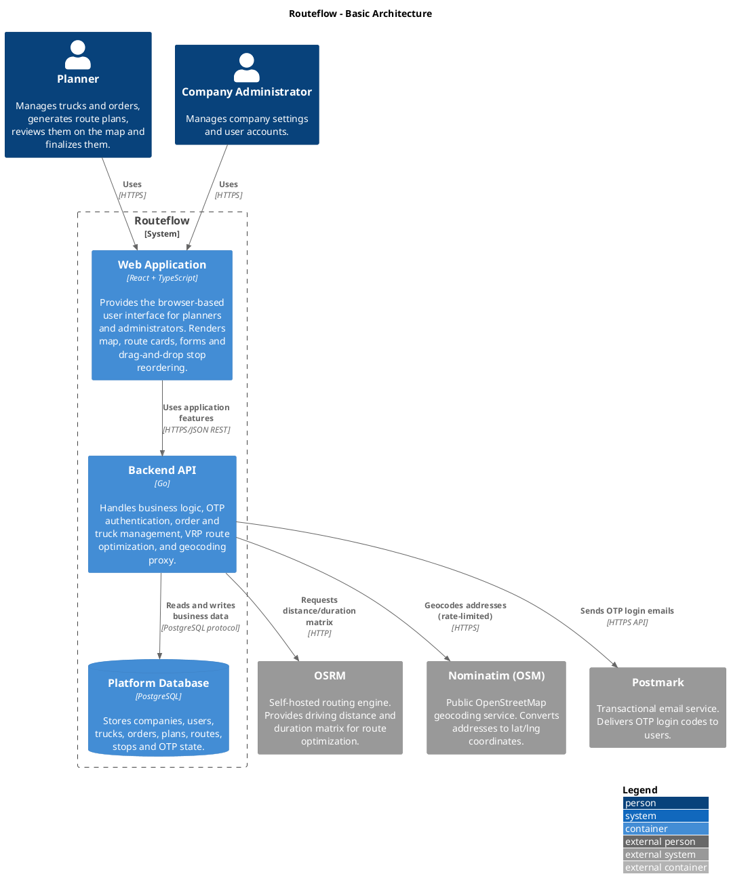
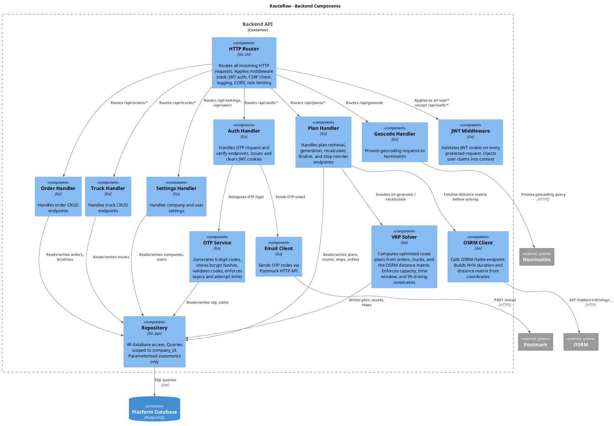
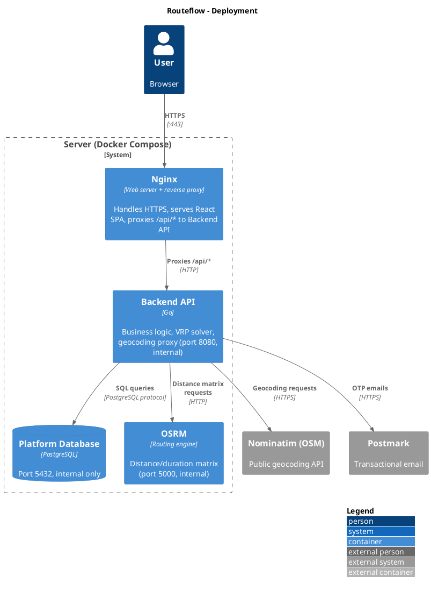

# Technical Design – Routeflow

---

## Introduction

This document describes the technical design for **Routeflow** a web application that automates daily route planning for small transport companies. It translates the functional requirements into a concrete system architecture and implementation approach.

Routeflow generates optimised route plans by solving a constrained Vehicle Routing Problem (VRP) using real-world driving distances and durations. The system integrates with a self-hosted OSRM routing engine and a geocoding service to convert addresses into coordinates and compute distance matrices.

The backend is responsible for core business logic including order and truck management, route optimisation, and constraint validation (capacity, time windows, and legal driving limits). The frontend provides an interactive interface for planners to review, adjust and finalise generated routes.

This document covers:
- the system architecture and component structure  
- the design of the backend API and data model  
- the implementation of the route optimisation logic  
- security and authentication mechanisms  
- scalability considerations and future extensions  

This design is based on the Functional Design. Familiarity with that document is assumed.

---

## Functional Summary

Routeflow is used by transport companies to plan daily routes. A company has one or more users with roles admin and planner. The admin manages company settings and user accounts. The planner manages trucks and orders, generates route plans, reviews the result on an interactive map, manually adjusts stop sequences via drag-and-drop and finalizes the plan.

The core constraints enforced by the system:

- Pallet capacity must not be exceeded at any point in a route.
- Delivery time windows (all day / morning / afternoon / custom) must be respected.
- EU maximum driving time of 9 hours per day (Regulation (EC) No 561/2006).
- Every route starts and ends at the company depot.

The target scale is 5–15 trucks and 30–60 orders per day per company.

---

## Technical Overview

The diagram below shows the Routeflow system at container level. Each box is a separately deployable unit or external system.



### Container descriptions

**Web Application** is the frontend. It handles all user interaction the map view (Leaflet), route cards, order and truck forms and drag-and-drop stop reordering. Server state is managed by TanStack Query. The app corresponds to all seven screens described in the functional design.

**Backend API** is the server-side application. It exposes a REST API, handles passwordless OTP authentication, runs the VRP solver, proxies geocoding requests to Nominatim and calls OSRM for driving distances.

**Platform Database** stores all domain entities (companies, users, trucks, orders, plans, routes, stops, locations) and OTP authentication state. The schema directly implements the entity model described in the functional design.

**OSRM** is a self-hosted routing engine. It provides a `/table` endpoint that returns an N×N matrix of driving durations and distances for a set of coordinates. This matrix is the input to the VRP solver. OSRM is used because the functional design specifies route calculations based on real driving distances.

**Nominatim (OSM)** is the public OpenStreetMap geocoding service. It converts addresses entered by planners into latitude/longitude coordinates required by the Location entity. Each company has its own set of location records, so the same address is geocoded independently per company. The Backend API proxies requests to `nominatim.openstreetmap.org` with an identifying User-Agent header and enforces the OSM usage policy of one request per second. The geocoding flow is triggered when saving an order and when saving the depot address.

**Postmark** is a SaaS transactional email provider used to deliver OTP login codes to users.

---

## Backend Architecture

The diagram below shows the internal component structure of the Go API server.



### Component descriptions

**HTTP Router** is the entry point for all HTTP requests. It applies a middleware stack JWT authentication, CSRF check, structured logging, CORS headers and rate limiting  before dispatching to handlers.

**JWT Middleware** validates the JWT cookie on every request to a protected endpoint. If valid, it injects the user's UUID, company UUID, and roles into the request context so handlers can access them without reading the cookie themselves.

**Auth Handler** handles the two-step OTP flow by delegating to the OTP Service and Email Client. On successful verification it issues a signed JWT cookie and redirects to the dashboard.

**OTP Service** encapsulates all OTP logic: generating a 6-digit code, storing its bcrypt hash with expiry in the database, validating submitted codes, counting failed attempts, and invalidating used or expired codes.

**VRP Solver** implements the route optimisation logic. It receives the distance/duration matrix from the OSRM Client and the list of orders and trucks, computes an optimised plan, and writes the resulting routes and stops via the Repository. It enforces all constraints from the functional design. The algorithm design is detailed in the Problem Solving document.

**OSRM Client** constructs the coordinate list from all unique locations in an order set, calls the OSRM `/table` endpoint, and returns a parsed N×N float64 matrix indexed by location ID.

**Geocode Handler** receives address query strings from the frontend, sanitises the input, proxies the request to Nominatim, and returns the top results as `[{ name, lat, lon }]`.

**Repository** is the single point of database access. All queries are parameterised and scoped to `company_id`. No handler constructs SQL directly.

### Transactions and external call retries

**Database transactions.** Plan generation, plan recalculation, manual stop reorder and plan finalisation are each executed inside a single PostgreSQL transaction. Recalculate for example deletes the existing routes/stops, writes new ones and updates order statuses either all of these commit together or none do. This prevents half-generated plans if the process crashes mid-write.

**Retries on external services.** Calls to OSRM and Nominatim use exponential backoff with jitter up to 3 attempts starting at 500ms delay and doubling. Postmark uses the same pattern. If all retries fail the caller receives `503 Service Unavailable` (OSRM) or an appropriate error (Nominatim/Postmark). This handles transient network errors without cascading failures to the user.

---

## Frontend Architecture

The React SPA implements all seven screens from the functional design. The architecture is organised around React Router for screen navigation, TanStack Query for server state and AuthContext for authentication state.

### Screen routing

```
/login                    → Screen 1 — Login
/verify                   → Screen 2 — Verify code
/dashboard                → Screen 3 — Dashboard
/trucks                   → Screen 4 — Trucks
/orders                   → Screen 5 — Orders
/routes                   → Screen 6 — Routes
/settings                 → Screen 7 — Settings
```

All routes except `/login` and `/verify` are wrapped in a `ProtectedRoute` component that checks `AuthContext`. If the JWT cookie is absent or `GET /api/me` returns 401 the user is redirected to `/login`.

### State management

**AuthContext** is a React context that holds the current user object (UUID, name, email, roles, company UUID). It is populated on app mount by calling `GET /api/me`. All role-based UI decisions (e.g. showing user management in Settings, which is admin-only per functional design read from this context).

**TanStack Query** manages all server state. Each domain entity has its own query key namespace:

| Query key | Endpoint |
|-----------|----------|
| `['trucks']` | `GET /api/trucks` | Screen 4 — Trucks |
| `['orders', date]` | `GET /api/orders?date=...` | Screen 5 — Orders |
| `['plan', date]` | `GET /api/plans/{date}` | Screen 3 — Dashboard, Screen 6 — Routes |
| `['geocode', q]` | `POST /api/geocode` | Screen 5 — Orders (address field) |
| `['settings']` | `GET /api/settings` | Screen 7 — Settings |
| `['users']` | `GET /api/users` | Screen 7 — Settings (admin only) |

Mutations (create/update/delete/recalculate/finalise) call `invalidateQueries` on success to keep the cache consistent.

### Plan generation flow

When the Routes screen loads, the frontend calls `GET /api/plans/{date}`. If this returns `404 Not Found` (no plan exists yet) and there are unplanned orders for that date, the frontend automatically calls `POST /api/plans/{date}` to generate the plan, then re-fetches the result. This keeps the GET endpoint idempotent and avoids server-state changes on read.

### Map component

The interactive map is implemented with `react-leaflet`. Stop markers are coloured by truck colour (stored in the `trucks` table, displayed in the functional design as coloured squares). Route lines connect stops in sequence. When the planner reorders stops via drag-and-drop, the map re-renders immediately on the updated local sequence before the PUT request completes.

### Drag-and-drop

Stop reordering uses `dnd-kit`. Each stop row has a drag handle (`≡`) as described in the functional design. Reordering is constrained to stops within the same truck's route cross-truck dragging is not permitted. On drop, the updated sequence array is sent to `PUT /api/plans/{date}/routes/{routeId}/stops`.

### Address autocomplete

The address field in the order form debounces input at 300 ms before calling `POST /api/geocode`. The backend returns up to 5 matching results, which are displayed in a dropdown. The planner selects one result; the confirmed lat/lng is stored alongside the order. If Nominatim returns no results, the dropdown shows "Address not found - please check the address." and the form cannot be submitted.

---

## Deployment Architecture

All containers run on a single server managed via Docker Compose.



Nginx is the single entry point to the system. It handles HTTPS serves the compiled React SPA (the static build output of vite build baked into the Nginx Docker image) as static files and reverse-proxies /api/* requests to the Backend API. Only Nginx is exposed to the internet on port 443. PostgreSQL, OSRM and the Backend API are only reachable within the Docker bridge network. Nominatim and Postmark are external services accessed over HTTPS.

---

## Design Choices

### 1. Go for the backend

**Choice:** The API server is implemented in Go 1.25 using the `chi` router.

**Motivation:** Go compiles to a single static binary with no runtime dependencies making deployment straightforward. Its standard library covers HTTP, JSON encoding and database access via `pgx`. Native goroutines make parallel OSRM requests trivial. The `chi` router is lightweight and idiomatic adding middleware support (logging, CORS, rate limiting) without a heavy framework.

**Alternatives considered:**

- **Node.js / TypeScript:** Familiar and fast to prototype but async complexity grows quickly and runtime errors are harder to catch without strict discipline.
- **Python / FastAPI:** Also viable for this type of project but for a compute-heavy VRP solver and simple static deployment, Go was preferred because it combines strong concurrency support with a single compiled binary and no runtime dependency management.

---

### 2. React + Vite for the frontend

**Choice:** React with Vite as the build tool.

**Motivation:** React has strong tooling and Leaflet.js has reliable React bindings (`react-leaflet`). Vite provides a fast development server and optimised production bundles. TanStack Query handles server state reducing manual loading and error state management throughout the app. The seven screens defined in the functional design map directly onto seven React Router routes.

**Alternatives considered:**

- **Next.js:** Adds server-side rendering, which is unnecessary here. The app is fully behind authentication and does not require SEO.
- **Vue + Vite:** Also viable. React was chosen based on familiarity and ecosystem depth for the required libraries (react-leaflet, dnd-kit).

---

### 3. PostgreSQL for persistence

**Choice:** PostgreSQL.

**Motivation:** The domain model from the functional design has a clear relational structure (companies → plans → routes → stops → orders with multiple foreign keys). PostgreSQL enforces referential integrity at the database level, supports UUID primary keys natively via `gen_random_uuid()` and provides timezone-aware timestamps (`TIMESTAMPTZ`) essential since the FD specifies all times are in Europe/Amsterdam. The `pgx` driver for Go provides a high-performance connection pool.

**Alternatives considered:**

- **SQLite:** Not suitable for a hosted multi-company web application. No concurrent write support.
- **MongoDB:** The document model does not map naturally to the relational structure. Foreign key constraints and joins are significantly more natural in SQL for this domain.

---

### 4. Passwordless authentication (OTP via email)

**Choice:** A 6-digit one-time code sent to the user's email address, expiring after 10 minutes.

**Motivation:** The functional design specifies passwordless login. Planners use the app daily passwords add unnecessary friction. OTP codes are simple to implement securely. Codes are stored as bcrypt hashes and invalidated on first use.

**Implementation flow:**

1. User submits email → server generates 6-digit code stores `bcrypt(code)` + expiry + `user_id` in the `otp_codes` table.
2. Server sends code via Postmark.
3. User submits code → server checks hash, verifies expiry, issues signed JWT as an HttpOnly cookie, marks code as used.
4. All subsequent requests authenticate via the JWT.

**Security details:**

- The server always responds identically whether the email exists or not (no user enumeration). This matches the functional design behaviour: *"If the email address is not registered, no error is shown."*
- Rate limit: 5 OTP requests per email address per 15 minutes, plus 10 OTP requests per IP address per 15 minutes to mitigate denial-of-service via random emails.
- 6 digits = 1,000,000 possibilities. With a lockout after 3 failed attempts, brute force is not practical within the 10-minute window.

**Alternatives considered:**

- **Magic link:** Equivalent security. OTP was chosen to keep the user in the same browser tab without depending on clicking a link from a mail client.
- **OAuth (Google/Microsoft):** Adds a dependency on a third-party identity provider. Not appropriate for a small B2B tool.

---

### 5. JWT via HttpOnly cookie

**Choice:** After OTP verification, the server issues a signed JWT stored in an HttpOnly, Secure, SameSite=Strict cookie. Expiry: 7 days.

**Motivation:** HttpOnly cookies are inaccessible to JavaScript, eliminating XSS-based token theft. SameSite=Strict prevents most CSRF attacks. The token is signed with HS256 using a server-side secret. It contains the user's UUID, company UUID, roles, and expiry. The server validates it on every request without a database lookup.

**Known limitation — no immediate revocation:** Because JWTs are validated statelessly, there is no way to revoke an individual token before its 7-day expiry if an account is compromised. The emergency mitigation is to rotate the signing secret, which invalidates every JWT system-wide and forces all users to log in again. This tradeoff is acceptable at the current scale because accounts are low-privilege (single-company, non-financial data) and daily-use OTP reduces the window in which a stolen token is useful. At scale this would be replaced with a short-lived access JWT + server-side refresh token (see alternatives).

**Alternatives considered:**

- **localStorage:** Simpler but vulnerable to XSS. Rejected on security grounds.
- **Server-side session table:** Allows instant revocation but adds a database read per request. JWT expiry (7 days) with short OTP codes provides adequate security without per-request database overhead.
- **Short-lived access JWT + refresh token:** 15-minute access JWT with a 7-day refresh token stored server-side. Adds one DB lookup on refresh but allows instant revocation. A stronger alternative, deferred to a future version when revocation becomes important.

---

### 6. VRP solver — greedy insertion + 2-opt, embedded in Go

**Choice:** A custom VRP solver embedded in the Go API server, using greedy nearest-neighbour insertion followed by 2-opt local search. The solver enforces pallet capacity, delivery time windows, and the EU 9-hour driving time limit.

**Motivation:** The target problem size (5–15 trucks, 30–60 orders) is small enough that a heuristic approach produces near-optimal plans within a one-second budget. Embedding the solver in the Go API avoids an additional service and keeps deployment simple. The detailed algorithm design, alternatives analysis, and performance measurements are covered in the separate Problem Solving document.

**Alternatives considered:**

- **OR-Tools (Google):** Industry-standard solver. Requires a separate Python/C++ process, significantly increasing deployment complexity. Not justified at this problem scale.
- **External SaaS (e.g. Routific):** Paid API, adds a network dependency to the critical planning path, and exposes customer addresses to a third party.

---

### 7. OSRM for routing

**Choice:** OSRM (Open Source Routing Machine), self-hosted via Docker.

**Motivation:** The FD specifies that route calculations are based on real driving distances and durations via OSRM (*Introduction*). OSRM provides a `/table` endpoint returning an N×N matrix of driving durations and distances in a single HTTP call — essential for the VRP solver.

**OSRM `/table` call:**

```
GET http://osrm:5000/table/v1/driving/{lon,lat;lon,lat;...}
    ?sources=all&destinations=all&annotations=duration,distance

Response:
{
  "durations": [[0, 847, ...], [823, 0, ...], ...],
  "distances": [[0, 12400, ...], [12380, 0, ...], ...]
}
```

**Self-hosting setup:**
1. Download Netherlands OSM extract (Geofabrik).
2. Pre-process: `osrm-extract`, `osrm-partition`, `osrm-customize` (MLD pipeline).
3. Run `osrm-routed` on the processed files.

**Alternatives considered:**

- **Public OSRM demo server:** Zero setup but rate-limited. Development only.
- **OpenRouteService:** Supports truck-specific routing (weight/height limits). Could replace OSRM in a future version since the domain model already stores truck dimensions.
- **Google Maps Distance Matrix API:** Accurate but paid and a hard external dependency.

---

### 8. Nominatim for geocoding

**Choice:** The public Nominatim OpenStreetMap geocoding service (`nominatim.openstreetmap.org`), accessed via a server-side proxy in the Backend API.

**Motivation:** When a planner enters an order address, the system resolves it to lat/lng (required by the Location entity in the FD, *Domain model — Location*). Nominatim uses OpenStreetMap data and is free to use. Routing through the Backend API instead of calling it directly from the browser: (1) avoids CORS issues, (2) centrally enforces the OSM usage policy (one request per second and an identifying User-Agent header), and (3) keeps the frontend decoupled from the geocoding provider, allowing replacement without frontend changes.

**Rate limiting:** The OSM usage policy allows a maximum of one request per second. The Backend API enforces this server-wide using a mutex that guarantees at least 1.2 seconds between outgoing requests. This is a simple and safe approach at the current scale (a single planner enters a handful of orders at a time).

**Known limitation — latency under concurrent use:** Because the gate is server-wide, concurrent geocoding requests queue up behind each other. Entering 10 orders in quick succession introduces roughly 12 seconds of total backend delay, and multiple planners working simultaneously would see additional queueing. This is acceptable at the current scale but becomes a bottleneck at higher load. At scale this is addressed by caching previously-geocoded addresses in Redis or switching to a self-hosted / commercial geocoder with higher rate limits (see Scalability).

**Choice of POST over GET:** The `/api/geocode` endpoint uses POST with a JSON body rather than GET with a query string. This simplifies handling of addresses containing spaces, diacritics, or reserved URL characters, and reserves GET semantics for truly cacheable resources. The endpoint does not modify server state beyond the rate-limit gate.

**Geocoding flow:**

1. Planner types address in order form.
2. Frontend debounces (300ms), calls `POST /api/geocode` with the query.
3. Backend API enforces the rate-limit gate, then calls `https://nominatim.openstreetmap.org/search?q={address}&format=json&limit=5&countrycodes=nl` with a custom User-Agent header.
4. Top results are returned as `[{ name, lat, lon }]` (up to 5 hits). The frontend shows these in a dropdown.
5. Planner selects one result from the dropdown; the chosen lat/lng is stored with the order as a Location record.

**Alternatives considered:**

- **Self-hosted Nominatim:** Would remove the rate limit and keep address data internal. Rejected because the operational cost (substantial disk space, RAM, initial data import) is not justified at the current scale.
- **Photon:** Lighter-weight geocoder based on OpenStreetMap. Less mature.
- **Google Geocoding API:** More accurate and higher rate limits, but paid and sends address data to Google.

---

### 9. Docker Compose deployment

**Choice:** Single VPS with Docker Compose. Nginx handles HTTPS, serves the React build, and reverse-proxies API requests.

**Motivation:** The application does not require Kubernetes at this scale. All containers run on one host, configured in a single `docker-compose.yml` file. Nginx is a well-known, well-documented web server that combines TLS termination, static file serving, and reverse proxying in a single component — simple to configure and operate. Docker named volumes persist the database, OSRM data, and TLS certificates across restarts.

**Alternatives considered:**

- **Caddy:** Has simpler config and more automatic HTTPS handling. Rejected because Nginx is more widely known and easier to maintain for operators already familiar with it.
- **Managed cloud (AWS ECS, GCP Cloud Run):** More resilient but significantly more complex and expensive at this scale.
- **Bare-metal:** Harder to reproduce, update, and roll back. Docker provides clean service separation.

---

## API Design

The Go server exposes a RESTful JSON API under `/api/`. All endpoints except `/api/auth/*` require a valid JWT cookie. All state-changing requests (POST/PUT/DELETE) require an `X-CSRF-Token` header matching the `csrf_token` cookie (double-submit CSRF protection — see Security).

### Authentication endpoints

| Method | Path | Description |
|--------|------|-------------|
| POST | `/api/auth/request-code` | Send OTP to email address |
| POST | `/api/auth/verify-code` | Verify OTP, set JWT cookie |
| POST | `/api/auth/logout` | Clear JWT cookie |

### Resource endpoints

| Method | Path | Description |
|--------|------|-------------|
| GET | `/api/trucks` | List trucks for the authenticated company | Screen 4 — Trucks |
| POST | `/api/trucks` | Create truck | Screen 4 — Trucks, Add form |
| PUT | `/api/trucks/{id}` | Update truck | Screen 4 — Trucks, Edit form |
| DELETE | `/api/trucks/{id}` | Delete truck (409 if part of any plan) | Screen 4 — Trucks |
| GET | `/api/orders?date=YYYY-MM-DD` | List orders for a date | Screen 5 — Orders |
| POST | `/api/orders` | Create order (triggers geocoding) | Screen 5 — Orders, Add form |
| PUT | `/api/orders/{id}` | Update order | Screen 5 — Orders, Edit form |
| DELETE | `/api/orders/{id}` | Delete order (409 if part of a finalized plan) | Screen 5 — Orders |
| GET | `/api/plans/{date}` | Get existing plan for date (404 if none exists) | Screen 6 — Routes |
| POST | `/api/plans/{date}` | Generate new plan by running VRP solver for unplanned orders on this date | Screen 6 — Routes (auto-generate on first visit) |
| POST | `/api/plans/{date}/recalculate` | Re-run VRP solver for date | Screen 6 — Routes, Recalculate button |
| POST | `/api/plans/{date}/finalize` | Set plan status to finalized | Screen 6 — Routes, Finalize button |
| PUT | `/api/plans/{date}/routes/{routeId}/stops` | Update stop sequence (manual reorder) | Screen 6 — Routes, drag handle |
| POST | `/api/geocode` | Geocode address via Nominatim proxy (body: `{query: string}`) | Screen 5 — Orders, Screen 7 — Settings |
| GET | `/api/settings` | Get company and account settings | Screen 7 — Settings |
| PUT | `/api/settings` | Update settings | Screen 7 — Settings |
| GET | `/api/users` | List users in the company (admin only) | Screen 7 — Settings, admin section |
| POST | `/api/users` | Invite a new user (admin only) | Screen 7 — Settings, admin section |
| GET | `/api/me` | Return current user from JWT | Used by AuthContext on app mount |
| GET | `/api/health` | Health check endpoint | Uptime monitoring |

### Error responses

All errors return a structured JSON body:

```json
{
  "error": "human-readable error message",
  "code": "machine-readable error code"
}
```

| HTTP status | Code | Situation |
|-------------|------|-----------|
| 400 | `validation_error` | Missing or invalid request fields | FD: Error states — Login invalid email |
| 401 | `unauthenticated` | No valid JWT cookie | — |
| 403 | `forbidden` | Resource belongs to another company, role check failed, or missing CSRF header | FD: Users and roles — Admin |
| 404 | `not_found` | Resource does not exist | — |
| 409 | `conflict` | Plan already finalized, or resource cannot be deleted because it is referenced | FD: Error states (implicit: finalised plan locked) |
| 422 | `vrp_infeasible` | VRP solver could not produce a valid plan — unscheduled orders listed in response | FD: Error states — Orders cannot be planned |
| 500 | `internal_error` | Unexpected server error | FD: Error states — Settings save failure |

### Manual stop reorder — revalidation

After a planner manually reorders stops via drag-and-drop, the frontend sends the updated sequence array to `PUT /api/plans/{date}/routes/{routeId}/stops`. The backend then:

1. Updates the `sequence` values for all stops in the route.
2. Recalculates `expected_arrival` for each stop based on departure time and OSRM travel durations.
3. Recalculates `total_distance`, `total_travel_time`, and `start_load_pallets` for the route.
4. Revalidates the route against capacity, time-window, and 9-hour driving-time constraints.
5. Persists the updated route and returns any constraint violations as warnings in the response body.

Constraint violations do not block saving — the planner sees warnings and can choose to recalculate or accept. This matches the behaviour described in the FD. Manual reorder does **not** change order status — orders remain `planned` if they were already assigned. Only `POST /api/plans/{date}/recalculate` resets orders to `unplanned` until the new plan is finalised.

**Request and response format:**

```
PUT /api/plans/2026-04-17/routes/{routeId}/stops
```

```json
Request body:
{
  "stop_sequence": ["stop-uuid-1", "stop-uuid-3", "stop-uuid-2"]
}
```

```json
Response 200 OK:
{
  "route": {
    "id": "route-uuid",
    "total_distance": 123.4,
    "total_travel_time": 4820,
    "start_load_pallets": 18,
    "departure_time": "07:00",
    "expected_return_time": "14:30",
    "stops": [ /* stops in new sequence */ ]
  },
  "warnings": [
    {
      "stop_id": "stop-uuid-2",
      "type": "time_window_violation",
      "message": "Arrives at 13:15, outside window 08:00–12:00"
    }
  ]
}
```

### Failure scenarios

| Failure | Behaviour |
|---------|-----------|
| OSRM unreachable | `POST /api/plans/{date}` and `POST /api/plans/{date}/recalculate` return `503 Service Unavailable`. The existing plan is not modified. | — |
| Nominatim returns no results | `POST /api/geocode` returns an empty array. The frontend shows "Address not found — please check the address." The order cannot be saved without a confirmed location. | FD: Error states — Nominatim |
| Postmark delivery failure | The endpoint always returns a generic success response to avoid user enumeration. If Postmark returns a delivery error, the error is logged and a new code can be requested. | FD: Screen 2 — Verify code, Resend link |
| Plan already finalized | All write endpoints for that plan return `409 Conflict` with code `plan_already_finalized`. | FD: Screen 6 — Routes, Finalize behaviour |
| Delete blocked by referenced resource | DELETE returns `409 Conflict` with code `resource_locked` when a truck is assigned to any plan, or when an order belongs to a finalized plan. | — |
| VRP produces no valid plan | `POST /api/plans/{date}` or `POST /api/plans/{date}/recalculate` returns `422 vrp_infeasible`. Unscheduled orders are listed in the error response body. | FD: Error states — Orders cannot be planned |
| No trucks available | Plan generation returns `422 vrp_infeasible` immediately without calling OSRM. | FD: Error states — No trucks available |

---

## Database Schema

The schema directly implements the domain model from the functional design.

**Key implementation decisions:**

- All primary keys are UUIDs generated by the database via `gen_random_uuid()`.
- Foreign keys use `ON DELETE CASCADE` where child entities have no meaning without the parent (routes without a plan, stops without a route).
- Timestamps use `TIMESTAMPTZ`. Dates use `DATE`. Times use `TIME`.
- All queries are scoped to `company_id` to enforce data isolation between companies.
- Counter fields (`plans.total_orders`, `plans.total_distance`, `routes.total_stops`, etc.) are denormalised for fast reads. They are recomputed atomically whenever a plan, route, or stop is modified by the backend — never written directly by the frontend.
- Foreign-key columns referencing users (`created_by`) are populated from the authenticated user's UUID in the JWT claims. They are never accepted from the request body.

**Core tables:**

```sql
CREATE TABLE companies (
    id                  UUID PRIMARY KEY DEFAULT gen_random_uuid(),
    name                TEXT NOT NULL,
    depot_location_id   UUID,
    created_at          TIMESTAMPTZ NOT NULL DEFAULT now()
);

CREATE TABLE locations (
    id          UUID PRIMARY KEY DEFAULT gen_random_uuid(),
    company_id  UUID NOT NULL REFERENCES companies(id) ON DELETE CASCADE,
    name        TEXT NOT NULL,
    address     TEXT NOT NULL,
    city        TEXT NOT NULL,
    country     TEXT NOT NULL DEFAULT 'NL',
    latitude    DOUBLE PRECISION NOT NULL,
    longitude   DOUBLE PRECISION NOT NULL
);

-- Deferred FK from companies.depot_location_id to locations.id,
-- added after both tables exist to avoid circular CREATE-time dependency
ALTER TABLE companies
    ADD CONSTRAINT fk_companies_depot_location
    FOREIGN KEY (depot_location_id) REFERENCES locations(id);

CREATE TABLE users (
    id          UUID PRIMARY KEY DEFAULT gen_random_uuid(),
    company_id  UUID NOT NULL REFERENCES companies(id) ON DELETE CASCADE,
    email       TEXT NOT NULL UNIQUE,
    name        TEXT NOT NULL,
    roles       TEXT[] NOT NULL,
    created_at  TIMESTAMPTZ NOT NULL DEFAULT now()
);

CREATE TABLE trucks (
    id                  UUID PRIMARY KEY DEFAULT gen_random_uuid(),
    company_id          UUID NOT NULL REFERENCES companies(id) ON DELETE CASCADE,
    name                TEXT NOT NULL,
    license_plate       TEXT NOT NULL,
    capacity_pallets    INTEGER NOT NULL,
    gross_weight_kg     INTEGER NOT NULL,
    length_m            DOUBLE PRECISION NOT NULL,
    width_m             DOUBLE PRECISION NOT NULL,
    height_m            DOUBLE PRECISION NOT NULL,
    color               TEXT NOT NULL,
    status              TEXT NOT NULL DEFAULT 'available'
);

CREATE TABLE orders (
    id                  UUID PRIMARY KEY DEFAULT gen_random_uuid(),
    company_id          UUID NOT NULL REFERENCES companies(id) ON DELETE CASCADE,
    created_by          UUID NOT NULL REFERENCES users(id),
    reference           TEXT,
    customer_name       TEXT NOT NULL,
    location_id         UUID NOT NULL REFERENCES locations(id),
    type                TEXT NOT NULL,
    pallet_count        INTEGER NOT NULL,
    weight_kg           INTEGER NOT NULL,
    date                DATE NOT NULL,
    time_window         TEXT NOT NULL DEFAULT 'all_day',
    time_window_start   TIME,
    time_window_end     TIME,
    status              TEXT NOT NULL DEFAULT 'unplanned',
    notes               TEXT,
    created_at          TIMESTAMPTZ NOT NULL DEFAULT now()
);

CREATE TABLE plans (
    id                  UUID PRIMARY KEY DEFAULT gen_random_uuid(),
    company_id          UUID NOT NULL REFERENCES companies(id) ON DELETE CASCADE,
    created_by          UUID NOT NULL REFERENCES users(id),
    date                DATE NOT NULL,
    status              TEXT NOT NULL DEFAULT 'pending',
    total_distance      DOUBLE PRECISION NOT NULL DEFAULT 0,
    total_travel_time   DOUBLE PRECISION NOT NULL DEFAULT 0,
    total_orders        INTEGER NOT NULL DEFAULT 0,
    created_at          TIMESTAMPTZ NOT NULL DEFAULT now(),
    UNIQUE (company_id, date)
);

CREATE TABLE routes (
    id                      UUID PRIMARY KEY DEFAULT gen_random_uuid(),
    plan_id                 UUID NOT NULL REFERENCES plans(id) ON DELETE CASCADE,
    truck_id                UUID NOT NULL REFERENCES trucks(id),
    total_distance          DOUBLE PRECISION NOT NULL DEFAULT 0,
    total_travel_time       DOUBLE PRECISION NOT NULL DEFAULT 0,
    total_stops             INTEGER NOT NULL DEFAULT 0,
    start_load_pallets      INTEGER NOT NULL DEFAULT 0,
    departure_time          TIME NOT NULL,
    expected_return_time    TIME NOT NULL
);

CREATE TABLE stops (
    id              UUID PRIMARY KEY DEFAULT gen_random_uuid(),
    route_id        UUID NOT NULL REFERENCES routes(id) ON DELETE CASCADE,
    order_id        UUID NOT NULL REFERENCES orders(id),
    sequence        INTEGER NOT NULL,
    type            TEXT NOT NULL,
    pallet_delta    INTEGER NOT NULL,
    expected_arrival TIME NOT NULL
);

CREATE TABLE otp_codes (
    id                  UUID PRIMARY KEY DEFAULT gen_random_uuid(),
    user_id             UUID NOT NULL REFERENCES users(id) ON DELETE CASCADE,
    code_hash           TEXT NOT NULL,
    expires_at          TIMESTAMPTZ NOT NULL,
    used                BOOLEAN NOT NULL DEFAULT false,
    failed_attempts     INTEGER NOT NULL DEFAULT 0,
    created_at          TIMESTAMPTZ NOT NULL DEFAULT now()
);
```

**Constraints:**

```sql
ALTER TABLE trucks
    ADD CONSTRAINT chk_trucks_capacity_positive CHECK (capacity_pallets > 0),
    ADD CONSTRAINT chk_trucks_status CHECK (status IN ('available', 'unavailable')),
    ADD CONSTRAINT uq_trucks_company_plate UNIQUE (company_id, license_plate);

ALTER TABLE orders
    ADD CONSTRAINT chk_orders_pallet_count_positive CHECK (pallet_count > 0),
    ADD CONSTRAINT chk_orders_weight_nonnegative CHECK (weight_kg >= 0),
    ADD CONSTRAINT chk_orders_type CHECK (type IN ('load', 'unload')),
    ADD CONSTRAINT chk_orders_status CHECK (status IN ('unplanned', 'planned')),
    ADD CONSTRAINT chk_orders_time_window CHECK (time_window IN ('all_day', 'morning', 'afternoon', 'custom'));

ALTER TABLE plans
    ADD CONSTRAINT chk_plans_status CHECK (status IN ('pending', 'finalized'));

ALTER TABLE stops
    ADD CONSTRAINT chk_stops_sequence_positive CHECK (sequence > 0),
    ADD CONSTRAINT uq_stops_route_sequence UNIQUE (route_id, sequence);

ALTER TABLE orders
    ADD CONSTRAINT chk_orders_custom_window CHECK (
        (time_window <> 'custom')
        OR (
            time_window_start IS NOT NULL
            AND time_window_end IS NOT NULL
            AND time_window_end > time_window_start
        )
    );
```

The `custom` time window constraint enforces that both `time_window_start` and `time_window_end` are provided and that the end is after the start. This corresponds to the FD: *Screen 5 — Orders*, Custom time window field behaviour.

**Cross-tenant integrity:**

To prevent an order in company A from referencing a location that belongs to company B, a composite foreign key enforces that an order's `(company_id, location_id)` pair must match an existing `(company_id, id)` pair in `locations`. This makes cross-tenant location references impossible at the database level, regardless of any application-layer bugs.

```sql
-- Composite unique key on locations to allow the composite FK below
ALTER TABLE locations
    ADD CONSTRAINT uq_locations_company_id UNIQUE (company_id, id);

-- Composite FK on orders: location must belong to the same company as the order
ALTER TABLE orders
    ADD CONSTRAINT fk_orders_location_company
    FOREIGN KEY (company_id, location_id)
    REFERENCES locations(company_id, id);
```

The same pattern is applied to the depot reference on `companies`: `depot_location_id` must point to a location whose `company_id` equals the company's own `id`. Because this is a self-referential check that cannot be expressed as a simple composite FK, it is enforced via a `CHECK` constraint with a trigger:

```sql
CREATE OR REPLACE FUNCTION check_depot_location_belongs_to_company()
RETURNS TRIGGER AS $$
BEGIN
    IF NEW.depot_location_id IS NOT NULL THEN
        IF NOT EXISTS (
            SELECT 1 FROM locations
            WHERE id = NEW.depot_location_id
              AND company_id = NEW.id
        ) THEN
            RAISE EXCEPTION 'Depot location must belong to the same company';
        END IF;
    END IF;
    RETURN NEW;
END;
$$ LANGUAGE plpgsql;

CREATE TRIGGER trg_companies_depot_location
BEFORE INSERT OR UPDATE ON companies
FOR EACH ROW EXECUTE FUNCTION check_depot_location_belongs_to_company();
```

This guarantees tenant isolation for the depot reference at the database level, matching the strictness of the composite FK on orders.

**Order status lifecycle:**

Orders move from `unplanned` to `planned` when assigned to a route during plan generation. Finalising a plan does not change order status further — it only locks the plan structure against modification. If a plan is recalculated, all orders belonging to that plan return to `unplanned` until the new plan is finalised. Manual stop reordering does not change order status.

**Indexes:**

```sql
CREATE INDEX idx_orders_company_date  ON orders(company_id, date);
CREATE INDEX idx_plans_company_date   ON plans(company_id, date);
CREATE INDEX idx_routes_plan_id       ON routes(plan_id);
CREATE INDEX idx_stops_route_id       ON stops(route_id);
CREATE INDEX idx_trucks_company_id    ON trucks(company_id);
CREATE INDEX idx_users_company_id     ON users(company_id);
CREATE INDEX idx_locations_company_id ON locations(company_id);
CREATE INDEX idx_otp_user_id          ON otp_codes(user_id);
CREATE INDEX idx_otp_active           ON otp_codes(user_id, used, expires_at);
```

Expired and used OTP codes are cleaned up by a background goroutine running hourly:

```sql
DELETE FROM otp_codes WHERE expires_at < now() OR used = true;
```

---

## Security

### Authentication

- Passwordless OTP: codes stored as bcrypt hashes, invalidated on first use, expire after 10 minutes. bcrypt was chosen over SHA-256 or MD5 because it is intentionally slow and includes a per-hash salt, making brute-force and rainbow table attacks computationally impractical even if the database is compromised. After three failed verification attempts, the OTP record is invalidated and a new code must be requested. This implements the FD behaviour: *"Invalid or expired code. Please try again."*.
- JWT: signed with HS256, stored in HttpOnly + Secure + SameSite=Strict cookie, expiry 7 days. A stateless JWT approach avoids a database lookup on each request. SameSite=Strict strongly reduces CSRF risk by preventing the browser from sending the authentication cookie on most cross-site requests.
- Rate limiting: 5 OTP requests per email address per 15 minutes, plus 10 OTP requests per IP address per 15 minutes (token bucket in Go middleware). This combination prevents both targeted brute-force and denial-of-service via random emails.

### Authorisation

The JWT contains the user's `company_id` and `roles`. Every database query is scoped to `company_id`. Role-protected endpoints check the roles array from the JWT before executing.

```sql
-- Fetching orders — always scoped to company
SELECT * FROM orders WHERE company_id = $1 AND date = $2

-- Updating a truck — 0 rows affected means 404/403
UPDATE trucks SET ... WHERE id = $1 AND company_id = $2
```

Admin-only endpoints (user management, company settings — FD: *Users and roles — Admin*) verify the `admin` role is present in the JWT claims before proceeding. If not, the server returns `403 Forbidden`.

**Location access:** The `locations` table is scoped per company via a `company_id` foreign key. This ensures full tenant isolation — a location created by company A is never visible to company B, even if both have the same customer address. The tradeoff is that the same address is geocoded independently per company, but this is acceptable at the current scale and avoids any cross-tenant data leakage.

### CSRF protection

CSRF protection is layered:

1. **SameSite=Strict cookie** — the primary defence. The browser refuses to send the JWT cookie on cross-site requests, blocking the vast majority of CSRF attack vectors.
2. **Double-submit CSRF token** — on successful login, the server sets a second cookie `csrf_token` (readable by JavaScript, *not* HttpOnly) containing a random 32-byte value. For every state-changing request (POST/PUT/DELETE), the frontend reads this cookie and echoes its value in an `X-CSRF-Token` header. The server compares the header value with the cookie value and rejects the request with `403 Forbidden` if they mismatch or are missing. Because an attacker's site cannot read the `csrf_token` cookie (same-origin policy), it cannot forge a matching header.
3. **`X-Requested-With: fetch` header** — set by the frontend's fetch wrapper on all state-changing requests. Rejected if missing. Protects against edge cases like legacy browsers with weaker SameSite support.

This is the industry-standard double-submit cookie pattern and is robust even if SameSite enforcement is bypassed in specific browser configurations.

### Transport security

- All browser traffic is HTTPS (TLS 1.2+), terminated by Nginx with a Let's Encrypt certificate (auto-renewed).
- HSTS header: `Strict-Transport-Security: max-age=31536000`.
- PostgreSQL, OSRM, and the Backend API are only reachable within the Docker bridge network — their ports are not published to the host. Nominatim and Postmark are external services accessed over HTTPS.

### Input validation

- All inputs validated server-side (Go struct tags + explicit validation). Frontend validation (Zod) is for UX only.
- SQL injection prevention: all queries use parameterised placeholders (`$1, $2, ...`) via `pgx`. No string-interpolated SQL.
- XSS prevention: user-provided text fields (customer names, notes, addresses) are never rendered as HTML — React escapes all string values by default. The backend additionally strips control characters before persisting.
- Geocoding: the `/api/geocode` endpoint sanitises the query string before proxying to Nominatim.

### CORS

```
Access-Control-Allow-Origin: https://app.routeflow.nl
Access-Control-Allow-Credentials: true
Access-Control-Allow-Methods: GET, POST, PUT, DELETE, OPTIONS
Access-Control-Allow-Headers: Content-Type, X-CSRF-Token, X-Requested-With
```

Wildcard origin is not used. The allowed origin is configured via an environment variable.

### Logging and privacy

Structured logs are written via Go's `slog` in JSON format. PII fields (email addresses, customer names, street addresses, geocoding queries) are redacted to `[redacted]` in log output to comply with GDPR. Error stack traces are logged in full but without PII payloads. Logs are retained for 30 days.

### Secrets management

JWT signing key, Postmark API key, and database password are passed as environment variables. On the production VPS these are stored in a `.env` file with `chmod 600`, read by Docker Compose. They are never committed to the repository. At scale these would move to a dedicated secrets manager (see Scalability).

---

## Scalability and Reliability

The current architecture (single VPS, Docker Compose, synchronous VRP) is intentionally designed for the MVP phase and comfortably supports up to approximately 50–100 companies on a suitably sized server (4–8 CPU cores, 16 GB RAM). Within that range, the only tuning required is vertical scaling of the VPS — no architectural changes.

This section describes how the design would change if Routeflow were required to support hundreds to thousands of companies, thousands of daily plans, and 99.9%+ uptime — significantly beyond the MVP scale. Each change below is a future step, not a current requirement.

### Observability in the current deployment

Even in the initial single-VPS deployment, basic operational visibility is important. The Go API exposes a `GET /api/health` endpoint for uptime monitoring. All requests and errors are logged in structured JSON format using Go's `slog` package. An external uptime check can monitor the health endpoint and alert on downtime.

### Backup and recovery

PostgreSQL is backed up daily using `pg_dump` to off-server storage. Docker images are version-tagged so the API and frontend can be rolled back to a previous working version if a deployment fails. Restore procedures are documented and tested periodically.

At the current MVP scale, the Recovery Point Objective (RPO) is approximately 24 hours (daily pg_dump) and Recovery Time Objective (RTO) is approximately 4 hours (manual restore on a replacement VPS). At 99.9% uptime scale, RPO would drop to 15 minutes via point-in-time recovery on managed Postgres, and RTO to under 1 hour via automated cross-region failover.

### Current design limitations

- A single VPS failure takes the entire system offline.
- CPU-bound VRP calculations run synchronously and could block API threads under concurrent load.
- PostgreSQL cannot be scaled independently from the API.
- OSRM shares host resources with the API.

### Changes required for extreme scalability

**1. Stateless horizontal API scaling**

The Go API is already stateless (JWT auth, no server-side session). Multiple instances can run behind a load balancer without modification. The JWT secret would move to a dedicated secrets manager (AWS Secrets Manager or HashiCorp Vault) instead of `.env` files.

**2. Managed PostgreSQL with read replicas and failover**

PostgreSQL would move to a managed service (AWS RDS or Supabase) with automated failover, read replicas for read-heavy queries, and point-in-time recovery with a 15-minute RPO.

**3. Asynchronous VRP solving (job queue)**

At scale, synchronous VRP solving would block API threads during peak morning hours when all planners generate their daily route plans simultaneously. The solution:

1. `POST /api/plans/{date}` and `POST /api/plans/{date}/recalculate` enqueue a job (Redis Streams) and return `202 Accepted` with a job ID.
2. A pool of dedicated VRP worker containers processes jobs from the queue.
3. The frontend receives the result via Server-Sent Events (SSE) on a per-job channel.

Redis is a new dependency introduced at this scale and would be run as a managed service (AWS ElastiCache or Redis Cloud).

**4. OSRM replication and Nominatim replacement**

OSRM would run as replicated containers behind an internal load balancer. For very high volumes, a commercial routing API (HERE, TomTom) would be evaluated.

At scale the public Nominatim API is no longer viable (1 req/sec limit, no SLA). Options: self-host Nominatim on dedicated infrastructure, switch to a commercial provider (Google, HERE, Mapbox), or cache previously-geocoded addresses in Redis to reduce outgoing requests entirely.

**5. Distance matrix caching**

For companies with stable locations (same customers daily), the OSRM distance matrix could be cached in Redis with a TTL. Cache keys are based on sorted pairs of location UUIDs. When a location's coordinates change (e.g. customer moves), the cache entries referencing that location are explicitly invalidated with a pattern delete (`DEL cache:matrix:*:{location_uuid}:*`). A cache hit avoids the OSRM call entirely.

**6. CDN for the React SPA**

Static assets would be served from a CDN (Cloudflare) instead of a single Nginx container. This introduces a split deployment: the SPA is served from `cdn.routeflow.nl` and the API from `api.routeflow.nl`. CORS and cookie-domain configuration are updated accordingly (cookie `Domain=.routeflow.nl`, CORS origin set to the CDN domain).

**7. Observability**

At this scale, structured logging, metrics (Prometheus + Grafana), and distributed tracing (OpenTelemetry) would be added to monitor API response times, VRP solver duration, queue depths, and error rates.

**Summary:**

| Concern | Current (single VPS) | At scale |
|---------|---------------------|----------|
| API instances | 1 | N (behind load balancer) |
| Database | PostgreSQL in Docker | Managed Postgres with replicas |
| VRP execution | Synchronous in API | Async job queue + workers |
| OSRM | Single container | Replicated containers behind internal LB |
| Geocoding | Public Nominatim API | Self-hosted or commercial provider + Redis cache |
| Distance matrix | Computed per request | Cached in Redis |
| Static assets | Nginx on VPS | CDN (Cloudflare) |
| Secrets | `.env` file | AWS Secrets Manager / Vault |
| RPO / RTO | 24h / 4h | 15min / <1h |
| Observability | Basic logging + health endpoint | Prometheus, Loki, OpenTelemetry |

---

## Help received

The following help was received during the creation of this functional design:

...