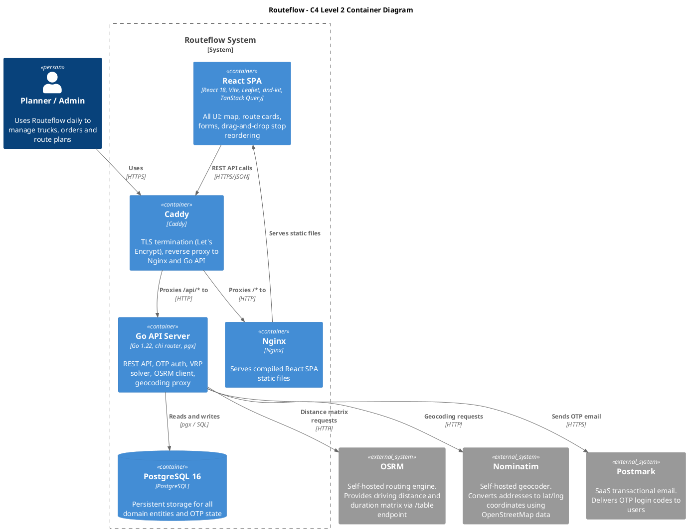

# Technical Design – Routeflow

---

## Introduction

This document describes the technical design for **Routeflow**, a web application that automates daily route planning for small transport companies. It covers system architecture, technology choices, API design, database schema, security, and scalability considerations.

This design is based on the **Functional Design – Routeflow**. Familiarity with that document is assumed. Where relevant, sections refer back to specific parts of the functional design.

---

## Functional Summary

Routeflow is used by transport companies to plan daily routes. A company has one or more users with roles: admin and planner. The admin manages company settings and user accounts. The planner manages trucks and orders, generates route plans, reviews the result on an interactive map, manually adjusts stop sequences via drag-and-drop, and finalises the plan.

The core constraints enforced by the system (from the Functional Design — Constraints and Business Rules):

- Pallet capacity must not be exceeded at any point in a route.
- Delivery time windows (all day / morning / afternoon / custom) must be respected.
- EU maximum driving time of 9 hours per day (Regulation (EC) No 561/2006).
- Every route starts and ends at the company depot.

The target scale is 5–15 trucks and 30–60 orders per day per company.

---

## Technical Overview — C4 Level 2 (Container Diagram)

The diagram below shows the Routeflow system at container level. Each box is a separately deployable unit or external system.



### Container descriptions

**React SPA** is the frontend application. It handles all user interaction: the map view (Leaflet), route cards, order and truck forms, and drag-and-drop stop reordering (dnd-kit). Server state is managed by TanStack Query.

**Go API Server** is the backend. It exposes a REST API, handles passwordless OTP authentication, runs the VRP solver, proxies geocoding requests to Nominatim, and calls OSRM for driving distances.

**PostgreSQL 16** stores all domain entities (companies, users, trucks, orders, plans, routes, stops, locations) and OTP authentication state.

**Nginx** serves the compiled React SPA as static files.

**Caddy** terminates TLS using Let's Encrypt automatic certificates and acts as a reverse proxy, routing `/api/*` to the Go API and `/*` to Nginx.

**OSRM** is a self-hosted routing engine. It provides a `/table` endpoint that returns an N×N matrix of driving durations and distances for a set of coordinates. This matrix is the input to the VRP solver.

**Nominatim** is a self-hosted geocoder based on OpenStreetMap. It converts addresses entered by planners into latitude/longitude coordinates required by the domain model.

**Postmark** is a SaaS transactional email provider used to deliver OTP login codes to users.

---

## Deployment Architecture

All containers run on a single VPS (Hetzner CX32) managed via Docker Compose.

```
Internet (HTTPS :443)
        │
        ▼
┌───────────────────┐
│   Caddy           │  ← TLS termination (Let's Encrypt auto-cert)
└──────┬────────────┘
       │
       ├─ /api/*  ──► Go API (internal port 8080)
       │                  │
       │                  ├──► PostgreSQL (internal port 5432)
       │                  ├──► OSRM       (internal port 5000)
       │                  └──► Nominatim  (internal port 8080)
       │
       └─ /*  ──────► Nginx serving React SPA (internal port 3000)
```

PostgreSQL, OSRM, and Nominatim are not exposed outside the Docker bridge network. Only Caddy is reachable from the internet.

---

## Design Choices

### 1. Go for the backend

**Choice:** The API server is implemented in Go 1.22 using the `chi` router.

**Motivation:** Go compiles to a single static binary with no runtime dependencies, making deployment straightforward. Its standard library covers HTTP, JSON encoding, and database access via `pgx`. Native goroutines make parallel OSRM requests trivial. The `chi` router is lightweight and idiomatic, adding middleware support (logging, CORS, rate limiting) without a heavy framework.

**Alternatives considered:**

- **Node.js / TypeScript:** Familiar and fast to prototype, but async complexity grows quickly and runtime errors are harder to catch without strict discipline.
- **Python / FastAPI:** Also viable for this type of project, but for a compute-heavy VRP solver and simple static deployment, Go was preferred because it combines strong concurrency support with a single compiled binary and no runtime dependency management.

---

### 2. React + Vite for the frontend

**Choice:** React 18 with Vite as the build tool.

**Motivation:** React has strong tooling and Leaflet.js has reliable React bindings (`react-leaflet`). Vite provides a fast development server and optimised production bundles. TanStack Query handles server state, reducing manual loading and error state management throughout the app.

**Alternatives considered:**

- **Next.js:** Adds server-side rendering, which is unnecessary here. The app is fully behind authentication and does not require SEO.
- **Vue + Vite:** Also viable. React was chosen based on familiarity and ecosystem depth for the required libraries (react-leaflet, dnd-kit).

---

### 3. PostgreSQL for persistence

**Choice:** PostgreSQL 16.

**Motivation:** The domain model from the functional design has a clear relational structure (companies → plans → routes → stops → orders, with multiple foreign keys). PostgreSQL enforces referential integrity at the database level, supports UUID primary keys natively via `gen_random_uuid()`, and provides timezone-aware timestamps (`TIMESTAMPTZ`) — essential since the functional design specifies all times are in Europe/Amsterdam. The `pgx` driver for Go provides a high-performance connection pool.

**Alternatives considered:**

- **SQLite:** Not suitable for a hosted multi-company web application. No concurrent write support.
- **MongoDB:** The document model does not map naturally to the relational structure. Foreign key constraints and joins are significantly more natural in SQL for this domain.

---

### 4. Passwordless authentication (OTP via email)

**Choice:** A 6-digit one-time code sent to the user's email address, expiring after 10 minutes.

**Motivation:** The functional design specifies passwordless login. Planners use the app daily — passwords add unnecessary friction. OTP codes are simple to implement securely. Codes are stored as bcrypt hashes and invalidated on first use.

**Implementation flow:**

1. User submits email → server generates 6-digit code, stores `bcrypt(code)` + expiry + `user_id` in the `otp_codes` table.
2. Server sends code via Postmark.
3. User submits code → server checks hash, verifies expiry, issues signed JWT as an HttpOnly cookie, marks code as used.
4. All subsequent requests authenticate via the JWT.

**Security details:**

- The server always responds identically whether the email exists or not (no user enumeration).
- Rate limit: 5 OTP requests per email address per 15 minutes.
- 6 digits = 1,000,000 possibilities. With a lockout after 3 failed attempts, brute force is not practical within the 10-minute window.

**Alternatives considered:**

- **Magic link:** Equivalent security. OTP was chosen to keep the user in the same browser tab without depending on clicking a link from a mail client.
- **OAuth (Google/Microsoft):** Adds a dependency on a third-party identity provider. Not appropriate for a small B2B tool.

---

### 5. JWT via HttpOnly cookie

**Choice:** After OTP verification, the server issues a signed JWT stored in an HttpOnly, Secure, SameSite=Strict cookie. Expiry: 7 days.

**Motivation:** HttpOnly cookies are inaccessible to JavaScript, eliminating XSS-based token theft. SameSite=Strict prevents CSRF. The token is signed with HS256 using a server-side secret. It contains the user's UUID, company UUID, roles, and expiry. The server validates it on every request without a database lookup.

**Alternatives considered:**

- **localStorage:** Simpler but vulnerable to XSS. Rejected on security grounds.
- **Server-side session table:** Allows revocation but adds a database read per request. JWT expiry (7 days) with short OTP codes provides adequate security without per-request database overhead.

---

### 6. VRP solver — greedy insertion + 2-opt, embedded in Go

**Choice:** A custom VRP solver embedded in the Go API server.

**Motivation:** The target problem size (5–15 trucks, 30–60 orders) is small. A greedy nearest-neighbour insertion heuristic followed by 2-opt local search produces plans within a few percent of optimal and runs in well under one second. Embedding the solver avoids an additional service and simplifies deployment.

**Algorithm:**

```
Input:
  - Distance/duration matrix (N×N) from OSRM
  - Orders: location, pallet_count, type, time_window
  - Trucks: capacity_pallets, company depot, status=available

Step 1 — Build distance matrix
  Call OSRM /table with all unique locations (depot + order locations)
  Store as float64 matrix indexed by location ID

Step 2 — Greedy insertion
  Sort orders by time window tightness (tightest window first)
  For each unassigned order:
    Find truck + insertion position with lowest marginal distance cost
    that satisfies: capacity constraint, time window, 9h driving limit
    Assign order to that truck at that position

Step 3 — 2-opt improvement (per route)
  For each pair of stops (i, j):
    Compute cost of reversing the sub-sequence between i and j
    If reversal reduces total route distance: apply it, restart
  Repeat until no improvement found or 500ms wall-clock limit reached

Step 4 — Calculate arrival times
  For each route, walk stops in sequence:
    expected_arrival[stop] = departure_time + cumulative travel time
  Check time window violations (warn, shown to planner)

Output:
  Plan with routes, stops, arrival times, pallet deltas, totals
```

**Alternatives considered:**

- **OR-Tools (Google):** Industry-standard solver. Requires a separate Python/C++ process, significantly increasing deployment complexity. Not justified at this problem scale.
- **External SaaS (e.g. Routific):** Paid API, adds a network dependency to the critical planning path, and exposes customer addresses to a third party.

---

### 7. OSRM for routing

**Choice:** OSRM (Open Source Routing Machine), self-hosted via Docker.

**Motivation:** Specified in the functional design. OSRM provides a `/table` endpoint returning an N×N matrix of driving durations and distances in a single HTTP call — essential for the VRP solver.

**OSRM `/table` call:**

```
GET http://osrm:5000/table/v1/driving/{lon,lat;lon,lat;...}
    ?sources=all&destinations=all&annotations=duration,distance

Response:
{
  "durations": [[0, 847, ...], [823, 0, ...], ...],
  "distances": [[0, 12400, ...], [12380, 0, ...], ...]
}
```

**Self-hosting setup:**
1. Download Netherlands OSM extract (Geofabrik).
2. Pre-process: `osrm-extract`, `osrm-partition`, `osrm-customize` (MLD pipeline).
3. Run `osrm-routed` on the processed files.

**Alternatives considered:**

- **Public OSRM demo server:** Zero setup but rate-limited. Development only.
- **OpenRouteService:** Supports truck-specific routing (weight/height limits). Could replace OSRM in a future version since the domain model already stores truck dimensions.
- **Google Maps Distance Matrix API:** Accurate but paid and a hard external dependency.

---

### 8. Nominatim for geocoding

**Choice:** Self-hosted Nominatim instance.

**Motivation:** When a planner enters an order address, the system resolves it to lat/lng (required by the Location entity in the domain model). Nominatim uses OpenStreetMap data. Self-hosting avoids rate limits, keeps address data internal, and avoids browser-side CORS issues by proxying through the Go API.

**Geocoding flow:**

1. Planner types address in order form.
2. Frontend debounces (300ms), calls `GET /api/geocode?q={address}`.
3. Go API proxies to Nominatim: `GET /search?q={address}&format=json&limit=3&countrycodes=nl`.
4. Returns top results as `[{ lat, lng, display_name }]`.
5. Planner confirms from dropdown; lat/lng is stored with the order as a Location record.

**Alternatives considered:**

- **Photon:** Lighter-weight geocoder based on OpenStreetMap. Less mature.
- **Google Geocoding API:** Accurate but paid and sends address data to Google.

---

### 9. Docker Compose deployment

**Choice:** Single VPS with Docker Compose.

**Motivation:** The application does not require Kubernetes at this scale. All containers run on one host. Caddy handles TLS termination automatically via Let's Encrypt. Docker named volumes persist database and OSRM data across restarts.

**Alternatives considered:**

- **Managed cloud (AWS ECS, GCP Cloud Run):** More resilient but significantly more complex and expensive at this scale.
- **Bare-metal:** Harder to reproduce, update, and roll back. Docker provides clean service separation.

---

## API Design

The Go server exposes a RESTful JSON API under `/api/`. All endpoints except `/api/auth/*` require a valid JWT cookie.

### Authentication endpoints

| Method | Path | Description |
|--------|------|-------------|
| POST | `/api/auth/request-code` | Send OTP to email address |
| POST | `/api/auth/verify-code` | Verify OTP, set JWT cookie |
| POST | `/api/auth/logout` | Clear JWT cookie |

### Resource endpoints

| Method | Path | Description |
|--------|------|-------------|
| GET | `/api/trucks` | List trucks for the authenticated company |
| POST | `/api/trucks` | Create truck |
| PUT | `/api/trucks/{id}` | Update truck |
| GET | `/api/orders?date=YYYY-MM-DD` | List orders for a date |
| POST | `/api/orders` | Create order (triggers geocoding) |
| PUT | `/api/orders/{id}` | Update order |
| GET | `/api/plans/{date}` | Get plan for date (auto-generates if unplanned orders exist) |
| POST | `/api/plans/{date}/recalculate` | Re-run VRP solver for date |
| POST | `/api/plans/{date}/finalize` | Set plan status to finalized |
| PUT | `/api/plans/{date}/routes/{routeId}/stops` | Update stop sequence (manual reorder) |
| GET | `/api/geocode?q={address}` | Geocode address via Nominatim proxy |
| GET | `/api/settings` | Get company and account settings |
| PUT | `/api/settings` | Update settings |
| GET | `/api/users` | List users in the company (admin only) |
| POST | `/api/users` | Invite a new user (admin only) |

### Error responses

All errors return a structured JSON body:

```json
{
  "error": "human-readable error message",
  "code": "machine-readable error code"
}
```

| HTTP status | Code | Situation |
|-------------|------|-----------|
| 400 | `validation_error` | Missing or invalid request fields |
| 401 | `unauthenticated` | No valid JWT cookie |
| 403 | `forbidden` | Resource belongs to another company or role check failed |
| 404 | `not_found` | Resource does not exist |
| 409 | `conflict` | Plan already finalized |
| 422 | `vrp_infeasible` | VRP solver could not produce a valid plan — unscheduled orders listed in response |
| 500 | `internal_error` | Unexpected server error |

### Manual stop reorder — revalidation

After a planner manually reorders stops via drag-and-drop, the frontend sends the updated sequence array to `PUT /api/plans/{date}/routes/{routeId}/stops`. The backend then:

1. Updates the `sequence` values for all stops in the route.
2. Recalculates `expected_arrival` for each stop based on departure time and OSRM travel durations.
3. Recalculates `total_distance`, `total_travel_time`, and `start_load_pallets` for the route.
4. Revalidates the route against capacity, time-window, and 9-hour driving-time constraints.
5. Persists the updated route and returns any constraint violations as warnings in the response body.

Constraint violations do not block saving — the planner sees warnings and can choose to recalculate or accept. This matches the behaviour described in the functional design.

### Failure scenarios

| Failure | Behaviour |
|---------|-----------|
| OSRM unreachable | `POST /api/plans/{date}/recalculate` returns `503 Service Unavailable`. The existing plan is not modified. |
| Nominatim returns no results | `GET /api/geocode` returns an empty array. The frontend shows "Address not found — please check the address." The order cannot be saved without a confirmed location. |
| Postmark delivery failure | The endpoint always returns a generic success response to avoid user enumeration. If Postmark returns a delivery error, the error is logged for monitoring and the OTP may be replaced on a subsequent resend request. |
| Plan already finalized | All write endpoints for that plan (`recalculate`, `finalize`, stop reorder) return `409 Conflict` with code `plan_already_finalized`. |
| VRP produces no valid plan | `POST /api/plans/{date}/recalculate` returns `422 vrp_infeasible`. The existing plan is not modified. Unscheduled orders are listed in the error response body. |

---

## Database Schema

The schema directly implements the domain model from the functional design.

**Key implementation decisions:**

- All primary keys are UUIDs generated by the database via `gen_random_uuid()`.
- Foreign keys use `ON DELETE CASCADE` where child entities have no meaning without the parent (routes without a plan, stops without a route).
- Timestamps use `TIMESTAMPTZ`. Dates use `DATE`. Times use `TIME`.
- All queries are scoped to `company_id` to enforce data isolation between companies.

**Core tables:**

```sql
CREATE TABLE companies (
    id                  UUID PRIMARY KEY DEFAULT gen_random_uuid(),
    name                TEXT NOT NULL,
    depot_location_id   UUID REFERENCES locations(id),
    created_at          TIMESTAMPTZ NOT NULL DEFAULT now()
);

CREATE TABLE users (
    id          UUID PRIMARY KEY DEFAULT gen_random_uuid(),
    company_id  UUID NOT NULL REFERENCES companies(id) ON DELETE CASCADE,
    email       TEXT NOT NULL UNIQUE,
    name        TEXT NOT NULL,
    roles       TEXT[] NOT NULL,
    created_at  TIMESTAMPTZ NOT NULL DEFAULT now()
);

CREATE TABLE locations (
    id          UUID PRIMARY KEY DEFAULT gen_random_uuid(),
    name        TEXT NOT NULL,
    address     TEXT NOT NULL,
    city        TEXT NOT NULL,
    country     TEXT NOT NULL DEFAULT 'NL',
    latitude    DOUBLE PRECISION NOT NULL,
    longitude   DOUBLE PRECISION NOT NULL
);

CREATE TABLE trucks (
    id                  UUID PRIMARY KEY DEFAULT gen_random_uuid(),
    company_id          UUID NOT NULL REFERENCES companies(id) ON DELETE CASCADE,
    name                TEXT NOT NULL,
    license_plate       TEXT NOT NULL,
    capacity_pallets    INTEGER NOT NULL,
    gross_weight_kg     INTEGER NOT NULL,
    length_m            DOUBLE PRECISION NOT NULL,
    width_m             DOUBLE PRECISION NOT NULL,
    height_m            DOUBLE PRECISION NOT NULL,
    color               TEXT NOT NULL,
    status              TEXT NOT NULL DEFAULT 'available'
);

CREATE TABLE orders (
    id                  UUID PRIMARY KEY DEFAULT gen_random_uuid(),
    company_id          UUID NOT NULL REFERENCES companies(id) ON DELETE CASCADE,
    created_by          UUID NOT NULL REFERENCES users(id),
    reference           TEXT NOT NULL,
    customer_name       TEXT NOT NULL,
    location_id         UUID NOT NULL REFERENCES locations(id),
    type                TEXT NOT NULL,
    pallet_count        INTEGER NOT NULL,
    weight_kg           INTEGER NOT NULL,
    date                DATE NOT NULL,
    time_window         TEXT NOT NULL DEFAULT 'all_day',
    time_window_start   TIME,
    time_window_end     TIME,
    status              TEXT NOT NULL DEFAULT 'unplanned',
    notes               TEXT,
    created_at          TIMESTAMPTZ NOT NULL DEFAULT now()
);

CREATE TABLE plans (
    id                  UUID PRIMARY KEY DEFAULT gen_random_uuid(),
    company_id          UUID NOT NULL REFERENCES companies(id) ON DELETE CASCADE,
    created_by          UUID NOT NULL REFERENCES users(id),
    date                DATE NOT NULL,
    status              TEXT NOT NULL DEFAULT 'pending',
    total_distance      DOUBLE PRECISION NOT NULL DEFAULT 0,
    total_travel_time   DOUBLE PRECISION NOT NULL DEFAULT 0,
    total_orders        INTEGER NOT NULL DEFAULT 0,
    created_at          TIMESTAMPTZ NOT NULL DEFAULT now(),
    UNIQUE (company_id, date)
);

CREATE TABLE routes (
    id                      UUID PRIMARY KEY DEFAULT gen_random_uuid(),
    plan_id                 UUID NOT NULL REFERENCES plans(id) ON DELETE CASCADE,
    truck_id                UUID NOT NULL REFERENCES trucks(id),
    total_distance          DOUBLE PRECISION NOT NULL DEFAULT 0,
    total_travel_time       DOUBLE PRECISION NOT NULL DEFAULT 0,
    total_stops             INTEGER NOT NULL DEFAULT 0,
    start_load_pallets      INTEGER NOT NULL DEFAULT 0,
    departure_time          TIME NOT NULL,
    expected_return_time    TIME NOT NULL
);

CREATE TABLE stops (
    id              UUID PRIMARY KEY DEFAULT gen_random_uuid(),
    route_id        UUID NOT NULL REFERENCES routes(id) ON DELETE CASCADE,
    order_id        UUID NOT NULL REFERENCES orders(id),
    sequence        INTEGER NOT NULL,
    type            TEXT NOT NULL,
    pallet_delta    INTEGER NOT NULL,
    expected_arrival TIME NOT NULL
);

CREATE TABLE otp_codes (
    id                  UUID PRIMARY KEY DEFAULT gen_random_uuid(),
    user_id             UUID NOT NULL REFERENCES users(id) ON DELETE CASCADE,
    code_hash           TEXT NOT NULL,
    expires_at          TIMESTAMPTZ NOT NULL,
    used                BOOLEAN NOT NULL DEFAULT false,
    failed_attempts     INTEGER NOT NULL DEFAULT 0,
    created_at          TIMESTAMPTZ NOT NULL DEFAULT now()
);
```

**Constraints:**

Although several domain state fields are stored as TEXT for implementation simplicity, invalid values are prevented through explicit CHECK constraints at the database level:

```sql
ALTER TABLE trucks
    ADD CONSTRAINT chk_trucks_capacity_positive CHECK (capacity_pallets > 0),
    ADD CONSTRAINT chk_trucks_status CHECK (status IN ('available', 'unavailable')),
    ADD CONSTRAINT uq_trucks_company_plate UNIQUE (company_id, license_plate);

ALTER TABLE orders
    ADD CONSTRAINT chk_orders_pallet_count_positive CHECK (pallet_count > 0),
    ADD CONSTRAINT chk_orders_weight_nonnegative CHECK (weight_kg >= 0),
    ADD CONSTRAINT chk_orders_type CHECK (type IN ('load', 'unload')),
    ADD CONSTRAINT chk_orders_status CHECK (status IN ('unplanned', 'planned')),
    ADD CONSTRAINT chk_orders_time_window CHECK (time_window IN ('all_day', 'morning', 'afternoon', 'custom'));

ALTER TABLE plans
    ADD CONSTRAINT chk_plans_status CHECK (status IN ('pending', 'finalized'));

ALTER TABLE stops
    ADD CONSTRAINT chk_stops_sequence_positive CHECK (sequence > 0),
    ADD CONSTRAINT uq_stops_route_sequence UNIQUE (route_id, sequence);

ALTER TABLE orders
    ADD CONSTRAINT chk_orders_custom_window CHECK (
        (time_window <> 'custom')
        OR (
            time_window_start IS NOT NULL
            AND time_window_end IS NOT NULL
            AND time_window_end > time_window_start
        )
    );
```

**Order status lifecycle:**

Orders move from `unplanned` to `planned` when assigned to a route during plan generation. Finalising a plan does not change the order status further — it only locks the plan structure against modification. If a plan is recalculated, all orders belonging to that plan return to `unplanned` until the new plan is finalised.

**Indexes:**

```sql
CREATE INDEX idx_orders_company_date  ON orders(company_id, date);
CREATE INDEX idx_plans_company_date   ON plans(company_id, date);
CREATE INDEX idx_routes_plan_id       ON routes(plan_id);
CREATE INDEX idx_stops_route_id       ON stops(route_id);
CREATE INDEX idx_trucks_company_id    ON trucks(company_id);
CREATE INDEX idx_users_company_id     ON users(company_id);
CREATE INDEX idx_otp_user_id          ON otp_codes(user_id);
```

Expired and used OTP codes are cleaned up by a background goroutine running hourly:

```sql
DELETE FROM otp_codes WHERE expires_at < now() OR used = true;
```

---

## Security

### Authentication

- Passwordless OTP: codes stored as bcrypt hashes, invalidated on first use, expire after 10 minutes. In addition to request rate limiting, verification attempts are tracked per OTP record. After three failed verification attempts, the OTP record is invalidated and a new code must be requested.
- JWT: signed with HS256, stored in HttpOnly + Secure + SameSite=Strict cookie, expiry 7 days. A stateless JWT approach avoids a database lookup on each request, but reduces immediate revocation options compared to a server-side session store. Given the small scale and short-lived OTP flow, this trade-off was accepted. SameSite=Strict strongly reduces CSRF risk by preventing the browser from sending the authentication cookie on most cross-site requests.
- Rate limiting: 5 OTP requests per email per 15 minutes (token bucket in Go middleware).

### Authorisation

The JWT contains the user's `company_id` and `roles`. Every database query is scoped to `company_id`. Role-protected endpoints check the roles array from the JWT before executing.

```sql
-- Fetching orders — always scoped to company
SELECT * FROM orders WHERE company_id = $1 AND date = $2

-- Updating a truck — 0 rows affected means 404/403
UPDATE trucks SET ... WHERE id = $1 AND company_id = $2
```

Admin-only endpoints (user management, company settings) verify the `admin` role is present in the JWT claims before proceeding. If not, the server returns `403 Forbidden`.

### Transport security

- All browser traffic is HTTPS (TLS 1.2+), terminated by Caddy with automatic Let's Encrypt certificates.
- HSTS header: `Strict-Transport-Security: max-age=31536000`.
- PostgreSQL, OSRM, and Nominatim are only reachable within the Docker bridge network — their ports are not published to the host.

### Input validation

- All inputs validated server-side (Go struct tags + explicit validation). Frontend validation (Zod) is for UX only.
- SQL injection prevention: all queries use parameterised placeholders (`$1, $2, ...`) via `pgx`. No string-interpolated SQL.
- Geocoding: the `/api/geocode` endpoint sanitises the query string before proxying to Nominatim.

### CORS

```
Access-Control-Allow-Origin: https://app.routeflow.nl
Access-Control-Allow-Credentials: true
Access-Control-Allow-Methods: GET, POST, PUT, DELETE, OPTIONS
```

Wildcard origin is not used. The allowed origin is configured via an environment variable.

### Secrets management

JWT signing key, Postmark API key, and database password are passed as environment variables. On the production VPS these are stored in a `.env` file with `chmod 600`, read by Docker Compose. They are never committed to the repository.

---

## Scalability and Reliability

This section describes how the design would change if Routeflow were required to support hundreds of companies, thousands of daily plans, and 99.9%+ uptime — significantly beyond the current target scale.

### Observability in the current deployment

Even in the initial single-VPS deployment, basic operational visibility is important. The Go API exposes a `GET /api/health` endpoint for uptime monitoring. All requests and errors are logged in structured JSON format using Go's `slog` package. An external uptime check can monitor the health endpoint and alert on downtime.

### Backup and recovery

In the current deployment, PostgreSQL is backed up daily using `pg_dump` to off-server storage. Docker images are version-tagged so the API and frontend can be rolled back to a previous working version if a deployment fails. Restore procedures are documented and tested periodically to reduce recovery risk in case of VPS failure.

### Current design limitations

- A single VPS failure takes the entire system offline.
- CPU-bound VRP calculations run synchronously and could block API threads under concurrent load.
- PostgreSQL cannot be scaled independently from the API.
- OSRM and Nominatim share host resources with the API.

### Changes required for extreme scalability

**1. Stateless horizontal API scaling**

The Go API is already stateless (JWT auth, no server-side session). Multiple instances can run behind a load balancer without modification. The JWT secret would move to a secrets manager (AWS Secrets Manager or HashiCorp Vault).

**2. Managed PostgreSQL with read replicas and failover**

PostgreSQL would move to a managed service (AWS RDS or Supabase) with automated failover, read replicas for read-heavy queries, and point-in-time recovery. Write queries route to the primary; reads route to replicas.

**3. Asynchronous VRP solving (job queue)**

At scale, synchronous VRP solving would block API threads during peak morning hours. The solution:

1. `POST /api/plans/{date}/recalculate` enqueues a job (Redis Streams) and returns `202 Accepted`.
2. A pool of dedicated VRP worker containers processes jobs from the queue.
3. The frontend receives the result via Server-Sent Events (SSE).

**4. OSRM and Nominatim as replicated services**

Both would run as replicated containers behind an internal load balancer. For very high volumes, a commercial routing API (HERE, TomTom) would be evaluated.

**5. Distance matrix caching**

For companies with stable locations (same customers daily), the OSRM distance matrix could be cached in Redis with a TTL. A cache hit avoids the OSRM call entirely.

**6. CDN for the React SPA**

Static assets would be served from a CDN (Cloudflare) instead of a single Nginx container.

**7. Observability**

At this scale, structured logging, metrics (Prometheus + Grafana), and distributed tracing (OpenTelemetry) would be added to monitor API response times, VRP solver duration, and error rates.

**Summary:**

| Concern | Current (single VPS) | At scale |
|---------|---------------------|----------|
| API instances | 1 | N (behind load balancer) |
| Database | PostgreSQL in Docker | Managed RDS with replicas |
| VRP execution | Synchronous in API | Async job queue + workers |
| OSRM / Nominatim | Single containers | Replicated containers |
| Distance matrix | Computed per request | Cached in Redis |
| Static assets | Nginx on VPS | CDN (Cloudflare) |
| Observability | Basic logging | Prometheus, Loki, OpenTelemetry |

---
## Help received

The following help was received during the creation of this functional design:

...